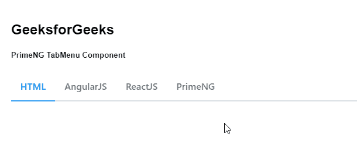

# 角度启动选项卡菜单组件

> 原文:[https://www . geesforgeks . org/angular-priming-tab menu-component/](https://www.geeksforgeeks.org/angular-primeng-tabmenu-component/)

Angular PrimeNG 是一个开源框架，具有一组丰富的本机 Angular UI 组件，用于实现出色的风格，该框架用于非常轻松地制作响应性网站。在本文中，我们将了解如何在 Angular PrimeNG 中使用 TabMenu 组件。

**标签菜单组件:**用于制作导航栏，将导航项目显示为导航标题 ie。，它是选项卡形式的菜单。

**属性:**

*   **模型**:是一个菜单项的数组。它接受数组作为输入数据类型&默认值为空。
*   **激活项**:定义默认的激活菜单项。它接受菜单项作为输入类型&默认值为空。
*   **样式**:设置组件的内嵌样式。它接受字符串作为输入数据类型&默认值为空。
*   **styleClass:** 是组件的样式类。它接受字符串作为输入数据类型&默认值为空。

**造型:**

*   **p-tabmenu:** 是容器元素。
*   **p-tabmenu-nav:** 是表头的列表元素。
*   **p-tabmenuitem:** 是菜单项的一个元素。
*   **p-menuitem-link:** 是菜单项内部的链接。
*   **p-menuitem-text:** 是菜单项的标签。
*   **p-menuitem-icon:** 是一个菜单项的图标。

**创建角度应用&模块安装:**

**步骤 1:** 使用以下命令创建角度应用程序。

```ts
ng new appname
```

**第二步**:创建项目文件夹即 appname 后，使用以下命令移动到该文件夹。

```ts
cd appname
```

**第三步**:在给定的目录下安装 PrimeNG。

```ts
npm install primeng --save
npm install primeicons --save
```

**项目结构:**安装完成后，如下图:


**示例 1:** 这是展示如何使用 TabMenu 组件的基本示例。

## app.component.html

```ts
<h2>GeeksforGeeks</h2>
<h5>PrimeNG TabMenu Component</h5>
<p-tabMenu [model]="gfg"></p-tabMenu>
```

## app.component.ts

```ts
import { Component } from '@angular/core';
import { MenuItem } from 'primeng/api';

@Component({
  selector: 'my-app',
  templateUrl: './app.component.html'
})
export class AppComponent {
  gfg: MenuItem[];

  ngOnInit() {
    this.gfg = [
      {
        label: 'HTML'
      },
      {
        label: 'AngularJS'
      },
      {
        label: 'ReactJS'
      },
      {
        label: 'PrimeNG'
      }
    ];
  }
}
```

## app.module.ts

```ts
import { NgModule } from '@angular/core';
import { BrowserModule } from '@angular/platform-browser';
import { RouterModule } from '@angular/router';
import { BrowserAnimationsModule } 
    from '@angular/platform-browser/animations';

import { AppComponent } from './app.component';
import { TabMenuModule } from 'primeng/tabmenu';

@NgModule({
  imports: [
    BrowserModule,
    BrowserAnimationsModule,
    TabMenuModule,
    RouterModule.forRoot([{ path: '', 
                    component: AppComponent }])
  ],
  declarations: [AppComponent],
  bootstrap: [AppComponent]
})
export class AppModule {}
```

**输出:**


**例 2:** 在本例中，第一项即。，在这种情况下，首次加载页面时会预先选择 HTML。

## app.component.html

```ts
<h2>GeeksforGeeks</h2>
<h5>PrimeNG TabMenu Component</h5>
<p-tabMenu [model]="gfg" [activeItem]="activeItem"></p-tabMenu>
```

## app.component.ts

```ts
import { Component } from '@angular/core';
import { MenuItem } from 'primeng/api';

@Component({
  selector: 'my-app',
  templateUrl: './app.component.html'
})
export class AppComponent {
  gfg: MenuItem[];

  activeItem: MenuItem;

  ngOnInit() {
    this.gfg = [
      {
        label: 'HTML'
      },
      {
        label: 'AngularJS'
      },
      {
        label: 'ReactJS'
      },
      {
        label: 'PrimeNG'
      }
    ];

    this.activeItem = this.gfg[0];
  }
}
```

## app.module.ts

```ts
import { NgModule } from '@angular/core';
import { BrowserModule } from '@angular/platform-browser';
import { RouterModule } from '@angular/router';
import { BrowserAnimationsModule } 
    from '@angular/platform-browser/animations';

import { AppComponent } from './app.component';
import { TabMenuModule } from 'primeng/tabmenu';

@NgModule({
  imports: [
    BrowserModule,
    BrowserAnimationsModule,
    TabMenuModule,
    RouterModule.forRoot([{ path: '', 
                  component: AppComponent }])
  ],
  declarations: [AppComponent],
  bootstrap: [AppComponent]
})
export class AppModule {}
```

**输出:**



**参考:**T2】https://primefaces.org/primeng/showcase/#/tabmenu