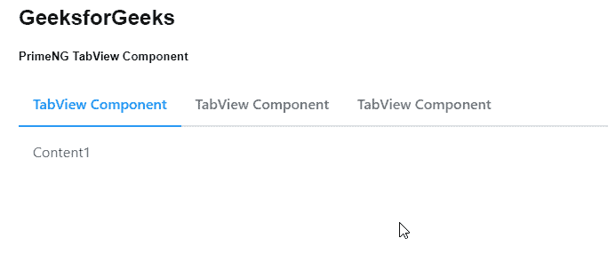
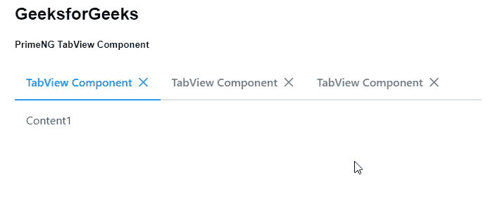

# 角向灌注选项卡视图组件

> 原文:[https://www . geesforgeks . org/angular-priming-tab view-component/](https://www.geeksforgeeks.org/angular-primeng-tabview-component/)

Angular PrimeNG 是一个开源框架，具有一组丰富的本机 Angular UI 组件，用于实现出色的风格，该框架用于非常轻松地制作响应性网站。在本文中，我们将了解如何在 Angular PrimeNG 中使用 TabView 组件。我们还将了解将在代码中使用的属性、事件、样式以及它们的语法。

**TabView 组件:**它用于以制表符的形式显示内容。

**选项卡视图的属性:**

*   **活动索引:**指定活动选项卡的索引，以编程方式更改选定的选项卡。它接受数字数据类型&默认值为空。
*   **控制关闭:**用于指定是否在 onClose 事件中控制标签关闭。它是布尔数据类型&默认值为假。
*   **样式:**是组件的内嵌样式。它是字符串数据类型&默认值为空。
*   **styleClass:** 是组件的样式类。它是字符串数据类型&默认值为空。

**选项卡面板的属性:**

*   **表头**:指定 tabPanel 的标题。它是字符串数据类型&默认值为空。
*   **选中**:定义标签是否激活。它是布尔数据类型&默认值为假。
*   **禁用**:指定 tab 值为真时不能激活。它是布尔数据类型&默认值为假。
*   **可关闭**:定义拉环是否可以移除。它是布尔数据类型&默认值为假。
*   **标题样式**:是标签标题的内嵌样式。它是字符串数据类型&默认值为空。
*   **表头样式类**:指定标签表头的样式类。它是字符串数据类型&默认值为空。
*   **缓存**:指定延迟加载的面板是否应该避免在重选时再次加载。它是布尔数据类型&默认值为真。
*   **工具提示**:指定悬停时在工具提示中显示的建议信息。它接受任何数据类型&默认值为空。
*   **tooltipStyleClass** :指定工具提示的样式类。它是字符串数据类型&默认值为空。
*   **tooltipPosition** :指定工具提示的位置，有效值为右、左、上、下。它是字符串数据类型&默认值是 top。
*   **tooltipPositionStyle** :指定 CSS 位置的类型。它是字符串数据类型&默认值是绝对的

**事件:**

*   **标签变更:**标签变更时触发的回调。
*   **onClose:** 是一个在 tab 关闭时触发的回调。

**造型:**

*   **p-tabview** :是容器元素
*   **p-tabview-nav** :是表头的容器。
*   **p-tabview-selected:** 是选中的 tab 表头。
*   **p-tabview-panels:** 是集装箱面板。
*   **p-tabview-panel:** 是一个 tab 的内容。

**创建角度应用&模块安装:**

*   **步骤 1:** 使用以下命令创建角度应用程序。

```ts
ng new appname
```

*   **步骤 2:** 创建项目文件夹即 appname 后，使用以下命令移动到该文件夹。

```ts
cd appname
```

*   **步骤 3:** 在给定的目录中安装 PrimeNG。

```ts
npm install primeng --save
npm install primeicons --save
```

**项目结构**:如下图:


**示例 1:** 这是说明如何使用 TabView 组件的基本示例。

## app.component.html

```ts
<h2>GeeksforGeeks</h2>
<h5>PrimeNG TabView Component</h5>
<p-tabView>
  <p-tabPanel header="TabView Component">
    <p>Content1</p>
  </p-tabPanel>
  <p-tabPanel header="TabView Component">
    <p>Content2</p>
  </p-tabPanel>
  <p-tabPanel header="TabView Component">
    <p>Content3</p>
  </p-tabPanel>
</p-tabView>
```

## app.component.ts

```ts
import { Component } from '@angular/core';

@Component({
  selector: 'my-app',
  templateUrl: './app.component.html',
  styleUrls: ['./app.component.scss']
})
export class AppComponent {}
```

## app.module.ts

```ts
import { NgModule } from "@angular/core";
import { BrowserModule } from "@angular/platform-browser";
import { BrowserAnimationsModule } 
    from "@angular/platform-browser/animations";

import { AppComponent } from "./app.component";
import { TabViewModule } from "primeng/tabview";

@NgModule({
  imports: [BrowserModule, 
              BrowserAnimationsModule, 
            TabViewModule],
  declarations: [AppComponent],
  bootstrap: [AppComponent],
})
export class AppModule {}
```

**输出:**



**示例 2:** 在本例中，我们将了解如何在 Tabview 组件中使用*可关闭的*属性。

## app.component.html

```ts
<h2>GeeksforGeeks</h2>
<h5>PrimeNG TabView Component</h5>
<p-tabView >
    <p-tabPanel header="TabView Component" closable='true'>
        <p>Content1</p>
    </p-tabPanel>
    <p-tabPanel header="TabView Component" closable='true'>
        <p>Content2</p>
    </p-tabPanel>
    <p-tabPanel header="TabView Component" closable='true'>
        <p>Content3</p>
    </p-tabPanel>
</p-tabView>
```

## app.component.ts

```ts
import { Component } from '@angular/core';

@Component({
  selector: 'my-app',
  templateUrl: './app.component.html',
  styleUrls: ['./app.component.scss']
})
export class AppComponent {}
```

## app.module.ts

```ts
import { NgModule } from "@angular/core";
import { BrowserModule } from "@angular/platform-browser";
import { BrowserAnimationsModule } 
    from "@angular/platform-browser/animations";

import { AppComponent } from "./app.component";
import { TabViewModule } from "primeng/tabview";

@NgModule({
  imports: [BrowserModule, 
              BrowserAnimationsModule, 
            TabViewModule],
  declarations: [AppComponent],
  bootstrap: [AppComponent],
})
export class AppModule {}
```

**输出:**



**参考:**T2】https://primefaces.org/primeng/showcase/#/tabview