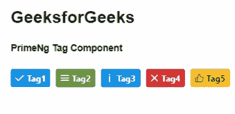
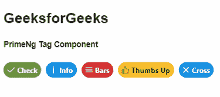

# 角形底漆标签组件

> 原文:[https://www . geesforgeks . org/angular-priming-tag-component/](https://www.geeksforgeeks.org/angular-primeng-tag-component/)

Angular PrimeNG 是一个开源框架，具有一组丰富的本机 Angular UI 组件，用于实现出色的风格，该框架用于非常轻松地制作响应性网站。在本文中，我们将了解如何在 Angular PrimeNG 中使用标记组件。

**标签组件:**用于制作标签，以便对内容进行分类。

**属性:**

*   **值**:指定标签内部显示的值。它是字符串数据类型，默认值为 null。
*   **严重性**:指定标签的严重性类型。它是字符串数据类型，默认值为 null。
*   **圆角**:指定标签边角是否圆角。它属于布尔数据类型，默认值为 false。
*   **图标**:设置标签的图标显示在数值旁边。它是字符串数据类型，默认值为 null。
*   **样式**:指定组件的内嵌样式。它属于对象数据类型，默认值为空。
*   **样式类**:指定组件的样式类。它是字符串数据类型，默认值为 null。

**造型:**

*   **p-tag:** 是一个标签元素。
*   **p-tag-rounded:** 用于制作圆形元素。
*   **p 标签图标:**是标签图标。
*   **p-tag-value:** 是标签的一个值。

**创建角度应用&模块安装:**

**步骤 1:** 使用以下命令创建角度应用程序。

```
ng new appname
```

**步骤 2:** 创建项目文件夹即 appname 后，使用以下命令移动到该文件夹。

```
cd appname
```

**步骤 3:** 在给定的目录中安装 PrimeNG。

```
npm install primeng --save
npm install primeicons --save
```

**项目结构**:安装完成后，如下图:


**示例 1:** 这是展示如何使用标签组件的基本示例。

## app.component.html

```
<h2>GeeksforGeeks</h2>
<h5>PrimeNg Tag Component</h5>
<p-tag styleClass="p-mr-2" value="Tag1" 
       icon="pi pi-check"></p-tag>
<p-tag styleClass="p-mr-2" value="Tag2" 
       icon="pi pi-bars" severity="success"></p-tag>
<p-tag styleClass="p-mr-2" value="Tag3" 
       icon="pi pi-info" severity="info"></p-tag>
<p-tag styleClass="p-mr-2" value="Tag4" 
       icon="pi pi-times" severity="danger"></p-tag>
<p-tag styleClass="p-mr-2" value="Tag5" 
       icon="pi pi-thumbs-up" severity="warning"></p-tag>
```

## app.module.ts

```
import { NgModule } from '@angular/core';
import { BrowserModule } from '@angular/platform-browser';
import { BrowserAnimationsModule } 
    from '@angular/platform-browser/animations';
import { AppComponent } from './app.component';
import { TagModule } from 'primeng/tag';

@NgModule({
  imports: [BrowserModule, 
              BrowserAnimationsModule, 
            TagModule],
  declarations: [AppComponent],
  bootstrap: [AppComponent]
})
export class AppModule {}
```

## app.component.ts

```
import { Component } from '@angular/core';

@Component({
  selector: 'my-app',
  templateUrl: './app.component.html'
})
export class AppComponent {}
```

**输出:**



**示例 2:** 在本例中，我们将在标签组件中使用 rounded 属性。

## app.component.html

```
<h2>GeeksforGeeks</h2>
<h5>PrimeNg Tag Component</h5>
<p-tag styleClass="p-mr-2" value="Check" rounded='true' 
       icon="pi pi-check" severity="success"></p-tag>
<p-tag styleClass="p-mr-2" value="Info" rounded='true' 
       icon="pi pi-info"></p-tag>
<p-tag styleClass="p-mr-2" value="Bars" rounded='true' 
       icon="pi pi-bars" severity="danger"></p-tag>
<p-tag styleClass="p-mr-2" value="Thumbs Up" rounded='true' 
       icon="pi pi-thumbs-up" severity="warning"></p-tag>
<p-tag styleClass="p-mr-2" value="Cross" rounded='true' 
       icon="pi pi-times" severity="info"></p-tag>
```

## app.module.ts

```
import { NgModule } from '@angular/core';
import { BrowserModule } from '@angular/platform-browser';
import { BrowserAnimationsModule } 
    from '@angular/platform-browser/animations';
import { AppComponent } from './app.component';
import { TagModule } from 'primeng/tag';

@NgModule({
  imports: [BrowserModule, 
              BrowserAnimationsModule, 
            TagModule],
  declarations: [AppComponent],
  bootstrap: [AppComponent]
})
export class AppModule {}
```

## app.component.ts

```
import { Component } from '@angular/core';

@Component({
  selector: 'my-app',
  templateUrl: './app.component.html'
})
export class AppComponent {}
```

**输出:**



**参考:**T2】https://primefaces.org/primeng/showcase/#/tag