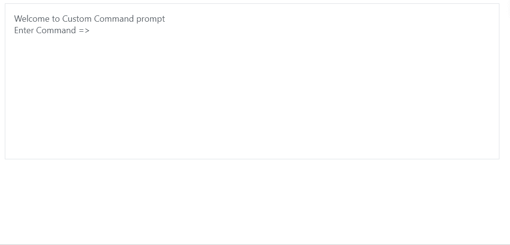

# 角焊端子组件

> 原文:[https://www . geesforgeks . org/angular-priming-terminal-component/](https://www.geeksforgeeks.org/angular-primeng-terminal-component/)

Angular PrimeNG 是一个开源框架，具有一组丰富的本机 Angular UI 组件，用于实现出色的风格，该框架用于非常轻松地制作响应性网站。在本文中，我们将了解如何在 Angular PrimeNG 中使用终端组件。我们还将了解将在代码中使用的属性、样式及其语法。

**终端组件:**用于制作基于文本的用户界面。

**属性:**

*   **欢迎留言**:是终端显示的初始文字。它是字符串数据类型，默认值为 null。
*   **提示**:是每个命令的提示文本。它是字符串数据类型，默认值为 null。
*   **样式**:是组件的内联样式，为字符串数据类型，默认值为空。
*   **样式类**:指定组件的样式类，为字符串数据类型，默认值为空。

**造型:**

*   **p 端:**是容器元素。
*   **p-terminal-content:** 是终端的内容。
*   **p-terminal-prompt:** 是提示文字。
*   **p 端响应:**是命令响应。
*   **p 端输入:**输入命令的输入元件。

**创建角度应用&模块安装:**

**步骤 1:** 使用以下命令创建角度应用程序。

```ts
ng new appname
```

**步骤 2:** 创建项目文件夹即 appname 后，使用以下命令移动到该文件夹。

```ts
cd appname
```

**步骤 3:** 在给定的目录中安装 PrimeNG。

```ts
npm install primeng --save
npm install primeicons --save
```

**项目结构:**安装完成后，如下图:


**示例:**这是展示如何使用终端组件的基本示例。

## app.component.html

```ts
<p-terminal welcomeMessage="Welcome to Custom Command prompt" 
            prompt="Enter Command =>"></p-terminal>
```

## app.component.ts

```ts
import { Component } from '@angular/core';
import { TerminalService } from 'primeng/terminal';
import { Subscription } from 'rxjs';

@Component({
  selector: 'my-app',
  templateUrl: './app.component.html',
  providers: [TerminalService]
})
export class AppComponent {
  subscription: Subscription;

  constructor(private terminalService: TerminalService) {
    this.terminalService.commandHandler.subscribe(command => {
      let response =
        command === 'cd abc'
          ? 'changed Current Directory to abc'
          : 'Please Enter a Valid Command: ';
      this.terminalService.sendResponse(response);
    });
  }
}
```

## app.module.ts

```ts
import { NgModule } from '@angular/core';
import { BrowserModule } from '@angular/platform-browser';
import { FormsModule, ReactiveFormsModule } from '@angular/forms';
import { HttpClientModule } from '@angular/common/http';
import { BrowserAnimationsModule } 
    from '@angular/platform-browser/animations';

import { AppComponent } from './app.component';
import { TerminalModule } from 'primeng/terminal';

@NgModule({
  imports: [
    BrowserModule,
    BrowserAnimationsModule,
    TerminalModule,
    FormsModule
  ],
  declarations: [AppComponent],
  bootstrap: [AppComponent]
})
export class AppModule {}
```

**输出:**



**参考:**T2】https://primefaces.org/primeng/showcase/#/terminal