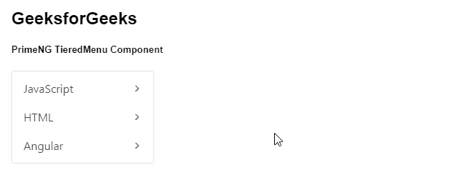
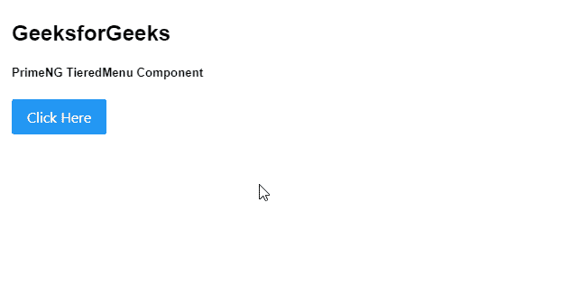

# 角形灌注贴膜菜单组件

> 原文:[https://www . geesforgeks . org/angular-priming-tieredmenu-component/](https://www.geeksforgeeks.org/angular-primeng-tieredmenu-component/)

Angular PrimeNG 是一个开源框架，具有一组丰富的本机 Angular UI 组件，用于实现出色的风格，该框架用于非常轻松地制作响应性网站。在本文中，我们将了解如何在 Angular PrimeNG 中使用 TieredMenu 组件。我们还将了解将在代码中使用的属性、方法、样式以及它们的语法。

**分层菜单组件:**允许用户以分层的形式制作菜单。

**属性:**

*   **模型**:是一个菜单项的数组。它是数组数据类型&默认值为空。
*   **弹出菜单**:定义菜单是否显示为弹出菜单。它属于布尔数据类型&默认值为假。
*   **追加到**:指定要附加叠加的目标元素&有效值为“body”或另一个元素的局部 ng-template 变量。属于数组数据类型&，默认值为空。
*   **样式**:设置组件的内嵌样式。它是字符串数据类型&默认值为空。
*   **样式类**:设置组件的样式类。它接受字符串数据类型&默认值为空。
*   **baseZIndex** :是一个用于分层的基 ZIndex 值。它接受数字作为输入数据类型&默认值为 0。
*   **autoZIndex** :指定是否自动管理分层。它属于布尔数据类型&默认值为真。
*   **自动显示**:指定是否在鼠标悬停时显示根子菜单。它属于布尔数据类型&默认值为假。
*   **显示过渡选项**:显示过渡选项来显示动画。它接受字符串数据类型&默认值为. 12s 三次贝塞尔曲线(0，0，0.2，1)。
*   **隐藏过渡选项**:显示隐藏动画的过渡选项。它接受字符串数据类型&默认值为. 1s 线性。

**方法:**

*   **切换:**用于切换弹出菜单的可见性。
*   **显示:**用于显示弹出菜单。
*   **隐藏:**用于隐藏弹出菜单。

**造型:**

*   **p-tieredmenu:** 是容器元素。
*   **p-menu-list:** 是列表元素。
*   **p-menuitem** :是 menuitem 元素。
*   **p-menuitem-text** :是菜单项的标签。
*   **p-menuitem-icon:** 是一个菜单项的图标。
*   **p-子菜单-图标:**是一个子菜单的箭头图标。

**创建角度应用&模块安装:**

**步骤 1:** 使用以下命令创建角度应用程序:

```
ng new appname
```

**步骤 2:** 创建项目文件夹即 appname 后，使用以下命令移动到该文件夹。

```
cd appname
```

**步骤 3:** 在给定的目录中安装 PrimeNG。

```
npm install primeng --save
npm install primeicons --save
```

**项目结构:**安装完成后，如下图:


**示例 1:** 这是展示如何使用 TieredMenu 组件的基本示例。

## app.component.html

```
<h2>GeeksforGeeks</h2>
<h5>PrimeNG TieredMenu Component</h5>
<p-tieredMenu [model]="gfg"></p-tieredMenu>
```

## app.component.ts

```
import { Component } from "@angular/core";
import { MenuItem } from "primeng/api";

@Component({
  selector: "my-app",
  templateUrl: "./app.component.html",
})
export class AppComponent {
  gfg: MenuItem[];

  ngOnInit() {
    this.gfg = [
      {
        label: "JavaScript",
        items: [
          {
            label: "JavaScript1",
            items: [
              {
                label: "JavaScript1.1",
              },
              {
                label: "JavaScript1.2",
              },
            ],
          },
          {
            label: "JavaScript2",
          },
          {
            label: "JavaScript3",
          },
        ],
      },
      {
        label: "HTML",
        items: [
          {
            label: "HTML 1",
          },
          {
            label: "HTML 2",
          },
        ],
      },
      {
        label: "Angular",

        items: [
          {
            label: "Angular 1",
          },
          {
            label: "Angular 2",
          },
        ],
      },
    ];
  }
}
```

## app.module.ts

```
import { NgModule } from "@angular/core";
import { BrowserModule } from "@angular/platform-browser";
import { BrowserAnimationsModule } 
    from "@angular/platform-browser/animations";

import { AppComponent } from "./app.component";
import { TieredMenuModule } from "primeng/tieredmenu";

@NgModule({
    imports: [BrowserModule, 
              BrowserAnimationsModule,
              TieredMenuModule],
    declarations: [AppComponent],
    bootstrap: [AppComponent]
})
export class AppModule {}
```

**输出:**



**示例 2:** 在本例中，我们将使用弹出式菜单制作 tieredmenu 组件。

## app.component.html

```
<h2>GeeksforGeeks</h2>
<h5>PrimeNG TieredMenu Component</h5>
<button #btn type="button" pButton label="Click Here"
        (click)="menu.toggle($event)"></button>
<p-tieredMenu #menu [model]="gfg" [popup]="true"></p-tieredMenu>
```

## app.component.ts

```
import { Component } from '@angular/core';
import { MenuItem } from 'primeng/api';

@Component({
  selector: 'my-app',
  templateUrl: './app.component.html'
})
export class AppComponent {
  gfg: MenuItem[];

  ngOnInit() {
    this.gfg = [
      {
        label: 'JavaScript',
        items: [
          {
            label: 'JavaScript1',
            items: [
              {
                label: 'JavaScript1.1'
              },
              {
                label: 'JavaScript1.2'
              }
            ]
          },
          {
            label: 'JavaScript2'
          },
          {
            label: 'JavaScript3'
          }
        ]
      },
      {
        label: 'HTML',
        items: [
          {
            label: 'HTML 1'
          },
          {
            label: 'HTML 2'
          }
        ]
      },
      {
        label: 'Angular',

        items: [
          {
            label: 'Angular 1'
          },
          {
            label: 'Angular 2'
          }
        ]
      }
    ];
  }
}
```

## app.module.ts

```
import { NgModule } from '@angular/core';
import { BrowserModule } from '@angular/platform-browser';
import { BrowserAnimationsModule } from '@angular/platform-browser/animations';

import { AppComponent } from './app.component';
import { TieredMenuModule } from 'primeng/tieredmenu';
import { ButtonModule } from 'primeng/button';

@NgModule({
  imports: [
    BrowserModule,
    BrowserAnimationsModule,
    TieredMenuModule,
    ButtonModule
  ],
  declarations: [AppComponent],
  bootstrap: [AppComponent]
})
export class AppModule {}
```

**输出:**



**参考:**T2】https://primefaces.org/primeng/showcase/#/tieredmenu