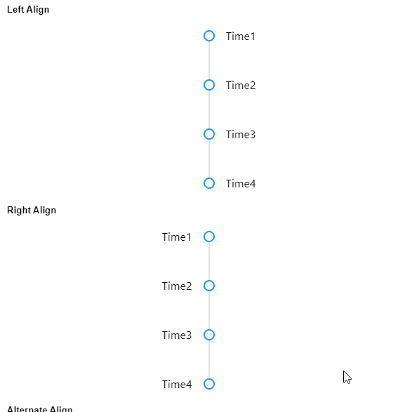
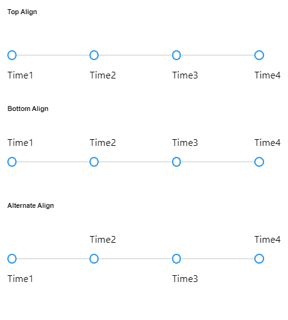

# 角度灌注时间线组件

> 原文:[https://www . geesforgeks . org/angular-priming-timeline-component/](https://www.geeksforgeeks.org/angular-primeng-timeline-component/)

Angular PrimeNG 是一个开源框架，具有一组丰富的本机 Angular UI 组件，用于实现出色的风格，该框架用于非常轻松地制作响应性网站。

在本文中，我们将了解如何在 Angular PrimeNG 中使用时间轴组件。我们还将了解将在代码中使用的属性、样式及其语法。

**时间轴组件:**用于显示流程的时间轴。

**属性:**

*   **值**:是要显示的事件数组。它是数组数据类型&默认值为空。
*   **对齐**:是时间轴条相对于内容的位置。它是字符串数据类型&默认值为左。
*   **布局**:是时间轴的方位。它是字符串数据类型&默认值是垂直。
*   **样式**:是组件的内嵌样式。它是字符串数据类型&默认值为空。
*   **styleClass** :是组件的样式类。它是字符串数据类型&默认值为空。

**造型:**

*   **p-timeline:** 是容器元素。
*   **p-timeline-left:** 是左对齐时的容器元素。
*   **p-timeline-right:** 是对齐正确时的容器元素。
*   **p-时间轴-顶部:**是对齐顶部时的容器元素。
*   **p-时间轴-底部:**是对齐为底部时的容器元素。
*   **p-timeline-alternate:** 是对齐交替时的容器元素。
*   **p-时间轴-垂直:**它是垂直时间轴的容器元素。
*   **p-时间轴-水平:**它是水平时间轴的容器元素。
*   **p-时间轴-事件:**是事件元素。
*   **p-时间轴-事件-对立:**是事件内容的对立。
*   **p-时间轴-事件-内容:**是事件内容。
*   **p-时间轴-事件-分隔符:**是事件的分隔符元素。
*   **p-时间轴-事件-标记:**是事件的标记元素。
*   **p-timeline-event-connector:**它是事件的连接器元素。

**创建角度应用&模块安装:**

**步骤 1:** 使用以下命令创建角度应用程序。

```ts
ng new appname
```

**步骤 2:** 创建项目文件夹即 appname 后，使用以下命令移动到该文件夹。

```ts
cd appname
```

**步骤 3:** 在给定的目录中安装 PrimeNG。

```ts
npm install primeng --save
npm install primeicons --save
```

**项目结构:**如下图:


**示例 1:** 这是展示如何使用时间轴组件的基本示例。

## app.component.html

```ts
<div class="card">
  <h5>Left Align</h5>
  <p-timeline [value]="gfg">
    <ng-template pTemplate="content" let-event> 
      {{event.status}} 
    </ng-template>
  </p-timeline>
</div>

<div class="card">
  <h5>Right Align</h5>
  <p-timeline [value]="gfg" align="right">
    <ng-template pTemplate="content" let-event> 
      {{event.status}} 
    </ng-template>
  </p-timeline>
</div>

<div class="card">
  <h5>Alternate Align</h5>
  <p-timeline [value]="gfg" align="alternate">
    <ng-template pTemplate="content" let-event> 
      {{event.status}} 
    </ng-template>
  </p-timeline>
</div>
```

## app.component.ts

```ts
import { Component } from "@angular/core";

@Component({
  selector: "my-app",
  templateUrl: "./app.component.html",
  styleUrls: ["./app.component.scss"],
})
export class AppComponent {
  gfg: any[];

  ngOnInit() {
    this.gfg = [
      {
        status: "Time 1",
      },
      {
        status: "Time 2",
      },
      {
        status: "Time 3",
      },
      {
        status: "Time 4",
      },
    ];
  }
}
```

## app.module.ts

```ts
import { NgModule } from "@angular/core";
import { BrowserModule } from "@angular/platform-browser";
import { BrowserAnimationsModule } 
    from "@angular/platform-browser/animations";
import { FormsModule } from "@angular/forms";

import { TimelineModule } from "primeng/timeline";
import { CardModule } from "primeng/card";
import { AppComponent } from "./app.component";

@NgModule({
  imports: [
    BrowserModule,
    BrowserAnimationsModule,
    FormsModule,
    TimelineModule,
    CardModule,
  ],
  declarations: [AppComponent],
  bootstrap: [AppComponent],
})
export class AppModule {}
```

**输出:**



**示例 2:** 在本例中，我们将了解如何在时间轴组件中使用*布局*属性。

## app.component.html

```ts
<h6>Top Align</h6>
<p-timeline [value]="arr" layout="horizontal" align="top">
  <ng-template pTemplate="content" let-event> 
    {{event.status}} 
  </ng-template>
</p-timeline>

<h6>Bottom Align</h6>
<p-timeline [value]="arr" layout="horizontal" align="bottom">
  <ng-template pTemplate="content" let-event> 
    {{event.status}} 
  </ng-template>
</p-timeline>

<h6>Alternate Align</h6>
<p-timeline [value]="arr" layout="horizontal" align="alternate">
  <ng-template pTemplate="content" let-event> 
    {{event.status}} 
  </ng-template>
  <ng-template pTemplate="opposite" let-event> 

  </ng-template>
</p-timeline>
```

## app.component.ts

```ts
import { Component } from "@angular/core";

@Component({
  selector: "my-app",
  templateUrl: "./app.component.html",
  styleUrls: ["./app.component.css"],
})
export class AppComponent {
  arr: any[];

  ngOnInit() {
    this.arr = [
      {
        status: "Time1",
      },
      {
        status: "Time2",
      },
      {
        status: "Time3",
      },
      {
        status: "Time4",
      },
    ];
  }
}
```

## app.module.ts

```ts
import { NgModule } from "@angular/core";
import { BrowserModule } from "@angular/platform-browser";
import { BrowserAnimationsModule } 
    from "@angular/platform-browser/animations";
import { FormsModule } from "@angular/forms";

import { TimelineModule } from "primeng/timeline";
import { CardModule } from "primeng/card";
import { AppComponent } from "./app.component";

@NgModule({
  imports: [
    BrowserModule,
    BrowserAnimationsModule,
    FormsModule,
    TimelineModule,
    CardModule,
  ],
  declarations: [AppComponent],
  bootstrap: [AppComponent],
})
export class AppModule {}
```

**输出:**



**参考:**T2】https://primefaces.org/primeng/showcase/#/timeline