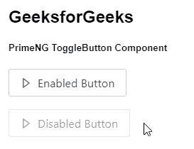
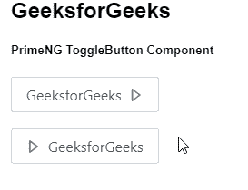

# 角向灌注按钮组件

> 原文:[https://www . geeksforgeeks . org/angular-priming-toggle button-component/](https://www.geeksforgeeks.org/angular-primeng-togglebutton-component/)

Angular PrimeNG 是一个开源框架，具有一组丰富的本机 Angular UI 组件，用于实现出色的风格，该框架用于非常轻松地制作响应性网站。在本文中，我们将了解如何在 Angular PrimeNG 中使用 ToggleButton 组件。

**ToggleButton 组件**用于制作一个按钮，用户点击即可进行切换。

**属性:**

*   **onLabel:** 用于设置 on 状态的标签。它是字符串数据类型，默认值为 null。
*   **离线标签:**用于设置标签为关闭状态。它是字符串数据类型，默认值为 null。
*   **onIcon:** 用于设置开启状态的图标。它是字符串数据类型，默认值为 null。
*   **官方:**用于设置图标为关闭状态。它是字符串数据类型，默认值为 null。
*   **图标位置:**用于设置图标的位置，有效值为“左”和“右”。它是字符串数据类型，默认值为左。
*   **样式:**用于设置元素的内联样式。它是字符串数据类型，默认值为 null。
*   **样式类**:用于设置元素的样式类。它是字符串数据类型，默认值为 null。
*   **禁用**:指定应禁用该元素。它属于布尔数据类型，默认值为 false。
*   **tabindex** :用于按跳转顺序设置元素的索引。它是数字数据类型，默认值为空。
*   **inputId:** 是底层输入元素的 Id 标识。它是字符串数据类型，默认值为空
*   **ariaLabel:** 用于定义标注输入元素的字符串，为字符串数据类型，默认值为空。

**事件:**

*   **onChange:** 是状态改变时触发的回调。

**造型:**

*   **p-togglebutton:** 它是一个造型容器元素
*   **p-button-icon-left:** 是一个造型图标元素。
*   **p-button-icon-right:** 是一个造型图标元素。
*   **p-button-text:** 它是一个样式标签元素。

**创建角度应用&模块安装:**

*   **步骤 1:** 使用以下命令创建角度应用程序。

    ```
    ng new appname
    ```

*   **步骤 2:** 创建项目文件夹即 appname 后，使用以下命令移动到该文件夹。

    ```
    cd appname
    ```

*   **步骤 3:** 在给定的目录中安装 PrimeNG。

    ```
    npm install primeng --save
    npm install primeicons --save
    ```

**项目结构**:如下图。


**示例 1:** 这是展示如何使用 ToggleButton 组件的基本示例。

## app.component.html

```
<h2>GeeksforGeeks</h2>
<h5>PrimeNG ToggleButton Component</h5>
<p-toggleButton
  [(ngModel)]="checked1"
  onIcon="pi pi-caret-left"
  offIcon="pi pi-caret-right"
  onLabel="ToggleButton Component"
  offLabel="Enabled Button">
</p-toggleButton>

<p-toggleButton
  [(ngModel)]="checked2"
  onIcon="pi pi-caret-left"
  offIcon="pi pi-caret-right"
  [disabled]
  onLabel="ToggleButton Component"
  offLabel="Disabled Button">
</p-toggleButton>
```

## app.component.ts

```
import { Component } from "@angular/core";
import { SelectItem, PrimeNGConfig } from "primeng/api";

@Component({
  selector: "my-app",
  templateUrl: "./app.component.html",
})
export class AppComponent {
  constructor(private primengConfig: PrimeNGConfig) {}

  ngOnInit() {
    this.primengConfig.ripple = true;
  }

  checked1: boolean = false;

  checked2: boolean = false;
}
```

## app.module.ts

```
import { NgModule } from "@angular/core";
import { BrowserModule } from "@angular/platform-browser";
import { FormsModule } from "@angular/forms";
import { BrowserAnimationsModule } 
    from "@angular/platform-browser/animations";

import { AppComponent } from "./app.component";

import { ToggleButtonModule } from "primeng/togglebutton";

@NgModule({
  imports: [
    BrowserModule,
    BrowserAnimationsModule,
    ToggleButtonModule,
    FormsModule,
  ],
  declarations: [AppComponent],
  bootstrap: [AppComponent],
})
export class AppModule {}
```

**输出:**



**示例 2:** 在本例中，我们将了解如何在 toggleButton 组件中使用 iconPos 属性。

## app.component.html

```
<h2>GeeksforGeeks</h2>
<h5>PrimeNG ToggleButton Component</h5>
<p-toggleButton
  [(ngModel)]="checked1"
  onIcon="pi pi-caret-left"
  offIcon="pi pi-caret-right"
  onLabel="ToggleButton Component"
  offLabel="GeeksforGeeks"
  iconPos="right">
</p-toggleButton>

<p-toggleButton
  [(ngModel)]="checked2"
  onIcon="pi pi-caret-left"
  offIcon="pi pi-caret-right"
  onLabel="ToggleButton Component"
  offLabel="GeeksforGeeks">
</p-toggleButton>
```

## app.component.ts

```
import { Component } from "@angular/core";
import { SelectItem, PrimeNGConfig } from "primeng/api";

@Component({
  selector: "app-root",
  templateUrl: "./app.component.html",
})
export class AppComponent {
  constructor(private primengConfig: PrimeNGConfig) {}

  ngOnInit() {
    this.primengConfig.ripple = true;
  }

  checked1: boolean = false;

  checked2: boolean = false;
}
```

## app.module.ts

```
import { NgModule } from "@angular/core";
import { BrowserModule } from "@angular/platform-browser";
import { FormsModule } from "@angular/forms";
import { BrowserAnimationsModule } 
    from "@angular/platform-browser/animations";

import { AppComponent } from "./app.component";

import { ToggleButtonModule } from "primeng/togglebutton";

@NgModule({
  imports: [
    BrowserModule,
    BrowserAnimationsModule,
    ToggleButtonModule,
    FormsModule,
  ],
  declarations: [AppComponent],
  bootstrap: [AppComponent],
})
export class AppModule {}
```

**输出:**



**参考:**T2】https://primefaces.org/primeng/showcase/#/togglebutton