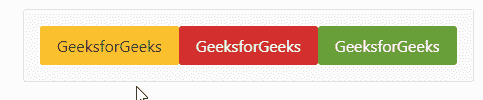

# 角度灌注工具栏组件

> 原文:[https://www . geesforgeks . org/angular-priming-toolbar-component/](https://www.geeksforgeeks.org/angular-primeng-toolbar-component/)

Angular PrimeNG 是一个与 Angular 一起使用的框架，用来创建具有很好样式的组件，这个框架非常易于使用，用于制作响应性网站。

在本文中，我们将了解如何在角度预处理中使用工具栏组件。**工具栏组件**用于对按钮和另一个组件进行分组。

**属性:**

*   **样式:**是组件的样式。它属于对象数据类型，默认值为空。
*   **styleClass:** 是组件的类。它是字符串数据类型，默认值为 null。

**造型:**

*   **p-toolbar:** 是主容器元素。
*   **p-工具栏-组-左侧:**是左侧内容容器。
*   **p-工具栏-组-右:**是 right 内容容器。

**创建角度应用和安装模块:**

*   **步骤 1:** 使用以下命令创建角度应用程序。

```
ng new appname
```

*   **步骤 2:** 创建项目文件夹即 appname 后，使用以下命令移动到该文件夹。

```
cd appname
```

*   **步骤 3:** 在给定的目录中安装 PrimeNG。

```
npm install primeng --save
npm install primeicons --save
```

**项目结构**:如下图。


**示例:**这是展示如何使用工具栏组件的基本示例

## app.component.html

```
<p-toolbar>
    <div class="p-toolbar-group-left">
        <p-button label="GeeksforGeeks" 
            styleClass="p-button-warning">
        </p-button>

        <p-button label="GeeksforGeeks" 
            styleClass="p-button-danger">
        </p-button>

        <p-button label="GeeksforGeeks" 
            styleClass="p-button-success">
        </p-button>
    </div>
</p-toolbar>
```

## app.module.ts

```
import { NgModule } from '@angular/core';
import { BrowserModule } from '@angular/platform-browser';
import { BrowserAnimationsModule } 
       from '@angular/platform-browser/animations';

import { AppComponent } from './app.component';

import { ToolbarModule } from 'primeng/toolbar';
import { ButtonModule } from 'primeng/button';

@NgModule({
  imports: [
    BrowserModule,
    BrowserAnimationsModule,
    ToolbarModule,
    ButtonModule
  ],

  declarations: [AppComponent],
  bootstrap: [AppComponent]
})
export class AppModule {}
```

**输出:**



**参考:**T2】https://primefaces.org/primeng/showcase/#/toolbar