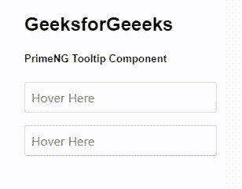
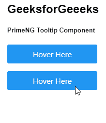

# 角度灌注工具提示组件

> 原文:[https://www . geesforgeks . org/angular-priming-tooltip-component/](https://www.geeksforgeeks.org/angular-primeng-tooltip-component/)

Angular PrimeNG 是一个开源框架，具有一组丰富的本机 Angular UI 组件，用于实现出色的风格，该框架用于非常轻松地制作响应性网站。在本文中，我们将了解如何在 Angular PrimeNG 中使用工具提示组件。我们还将了解将在代码中使用的属性、样式及其语法。

**工具提示组件:**它用来制作一个为组件提供咨询信息的元素。

**属性:**

*   **ptoltip:**是工具提示的文本。它是字符串数据类型&默认值为空。
*   **工具提示位置:**是工具提示的位置。它是字符串数据类型&默认值是正确的。
*   **工具提示事件:**是显示工具提示的事件。它是字符串数据类型&默认值是悬停。
*   **positionStyle:** 是表示 CSS 位置类型的文本。它是字符串数据类型&默认值是绝对的。
*   **tooltipDisabled:** 用于指定是否应禁用组件。它是布尔数据类型&默认值为假。
*   **appendTo:** 用于指定附着叠加的目标元素。它是字符串数据类型&默认值为任意。
*   **隐藏延迟:**是以毫秒为单位隐藏工具提示的延迟。它是数字数据类型&默认值为空。
*   **显示延迟:**是以毫秒为单位显示工具提示的延迟。它是数字数据类型&默认值为空。
*   **生命:**是工具提示即使激活也要等待毫秒才能隐藏的时间。它是数字数据类型&默认值为空。
*   **tooltipStyleClass:** 是工具提示的样式类。它是字符串数据类型&默认值为空。
*   **转义:**用于指定内容是否呈现为文本。它是布尔数据类型&默认值为真。
*   **tooltipZIndex:** 用于指定是否自动管理 z-index。它是字符串数据类型&默认值是自动。

**造型:**

*   **p-工具提示:**是容器元素。
*   **p-工具提示-箭头:**是工具提示的箭头。
*   **p-工具提示-文字:**是工具提示的文字。

**创建角度应用&模块安装:**

*   **步骤 1:** 使用以下命令创建角度应用程序。

```
ng new appname
```

*   **步骤 2:** 创建项目文件夹即 appname 后，使用以下命令移动到该文件夹。

```
cd appname
```

*   **步骤 3:** 在给定的目录中安装 PrimeNG。

```
npm install primeng --save
npm install primeicons --save
```

**项目结构**:如下图:


**示例 1:** 这是说明如何在工具提示组件中实现*焦点*事件显示和模糊隐藏的基本示例。

## app.component.html

```
<h2>GeeksforGeeeks</h2>
<h5>PrimeNG Tooltip Component</h5>
<div class="p-grid p-fluid">
  <div class="p-col-12 p-md-3">
    <input
      type="text"
      pInputText
      pTooltip="It is a tooltip"
      placeholder="Hover Here"
      tooltipEvent="focus"/>
  </div>
  <div class="p-col-12 p-md-3">
    <input
      type="text"
      pInputText
      pTooltip="It is a tooltip"
      placeholder="Hover Here"
      tooltipPosition="bottom"
      tooltipEvent="focus"/>
  </div>
</div>
```

## app.component.ts

```
import { Component } from '@angular/core';

@Component({
  selector: 'mt-app',
  templateUrl: './app.component.html',
  styleUrls: ['./app.component.scss']
})
export class AppComponent {}
```

## app.module.ts

```
import { NgModule } from "@angular/core";
import { BrowserModule } from "@angular/platform-browser";
import { BrowserAnimationsModule } 
    from "@angular/platform-browser/animations";

import { AppComponent } from "./app.component";
import { TooltipModule } from "primeng/tooltip";
import { InputTextModule } from "primeng/inputtext";

@NgModule({
  imports: [
    BrowserModule,
    BrowserAnimationsModule,
    TooltipModule,
    InputTextModule,
  ],
  declarations: [AppComponent],
  bootstrap: [AppComponent],
})
export class AppModule {}
```

**输出:**



**示例 2:** 在本例中，我们将在一个按钮中使用工具提示组件。

## app.component.html

```
<h2>GeeksforGeeeks</h2>
<h5>PrimeNG Tooltip Component</h5>
<div class="p-grid p-fluid">
  <div class="p-col-12 p-md-3">
    <p-button label="Hover Here" pTooltip="It is a tooltip"></p-button>
  </div>
  <div class="p-col-12 p-md-3">
    <p-button
      label="Hover Here"
      pTooltip="It is a tooltip"
      tooltipPosition="bottom">
    </p-button>
  </div>
</div>
```

## app.component.ts

```
import { Component } from '@angular/core';

@Component({
  selector: 'mt-app',
  templateUrl: './app.component.html',
  styleUrls: ['./app.component.scss']
})
export class AppComponent {}
```

## app.module.ts

```
import { NgModule } from "@angular/core";
import { BrowserModule } from "@angular/platform-browser";
import { BrowserAnimationsModule } 
    from "@angular/platform-browser/animations";

import { AppComponent } from "./app.component";
import { TooltipModule } from "primeng/tooltip";
import { ButtonModule } from "primeng/button";

@NgModule({
  imports: [
    BrowserModule,
    BrowserAnimationsModule,
    TooltipModule,
    ButtonModule,
  ],
  declarations: [AppComponent],
  bootstrap: [AppComponent],
})
export class AppModule {}
```

**输出:**



**参考:**T2】https://primefaces.org/primeng/showcase/#/tooltip