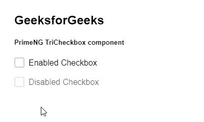
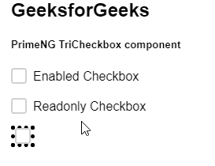

# 角向灌注三色盒组件

> 原文:[https://www . geesforgeks . org/angular-priming-tricheckbox-component/](https://www.geeksforgeeks.org/angular-primeng-tricheckbox-component/)

Angular PrimeNG 是一个开源框架，具有一组丰富的本机 Angular UI 组件，用于实现出色的风格，该框架用于非常轻松地制作响应性网站。在本文中，我们将了解如何在 Angular PrimeNG 中使用 TriCheckbox 组件。

**三复选框组件:**它允许用户使用三种状态即真、假&空条件来创建复选框。

**属性:**

*   **名称**:用于给出元素的名称。它是字符串数据类型，默认值为 null。
*   **标签**:用于给出元素的标签。它是字符串数据类型，默认值为 null。
*   **禁用**:用于禁用元素。它是布尔数据类型，默认值为 false。
*   **tabindex** :用于按跳转顺序设置元素的索引。它是数字数据类型，默认值为空。
*   **输入项**:是底层输入元素的 Id 标识。它是字符串数据类型，默认值为 null。
*   **ArialabelBy**:ArialabelBy 属性建立组件和标签之间的关系，其值应该是一个或多个元素标识。它是字符串数据类型，默认值为 null。
*   **样式**:用于给出组件的 Inline 样式。它属于对象数据类型，默认值为空。
*   **styleClass** :是组件的 Style 类。它是字符串数据类型，默认值为 null。
*   **只读**:指定组件不可编辑。它是布尔数据类型，默认值为 false。
*   **复选框真值图标**:用于设置复选框真值的指定图标。它是字符串数据类型，默认值是 pi pi-check。
*   **复选框假图标**:用于设置复选框假值的指定图标。它是字符串数据类型，默认值是 pi pi-check。

**事件:**

*   **onChange:** 是一个在值改变时触发的回调。

**造型:**

*   **p-chkbox:** 是容器元素。
*   **p-tristeckbox:**是容器元素。
*   **p-chkbox-box:** 是图标的容器。
*   **p-chkbox-icon:** 是图标元素。

**创建角度应用&模块安装:**

*   **步骤 1:** 使用以下命令创建角度应用程序。

    ```ts
    ng new appname
    ```

*   **步骤 2:** 创建项目文件夹即 appname 后，使用以下命令移动到该文件夹。

    ```ts
    cd appname
    ```

*   **步骤 3:** 在给定的目录中安装 PrimeNG。

    ```ts
    npm install primeng --save
    npm install primeicons --save
    ```

**项目结构**:如下图:


**示例 1:** 这是展示如何使用 TriCheckbox 组件的基本示例。**T3】**

## app.component.html

```ts
<h2>GeeksforGeeks</h2>
<h5>PrimeNG TriCheckbox component</h5>
<p-triStateCheckbox label="Enabled Checkbox"></p-triStateCheckbox>

<p-triStateCheckbox
  disabled="true"
  label="Disabled Checkbox">
</p-triStateCheckbox>
```

## app.module.ts

```ts
import { NgModule } from "@angular/core";
import { BrowserModule } from "@angular/platform-browser";
import { FormsModule } from "@angular/forms";
import { BrowserAnimationsModule } 
    from "@angular/platform-browser/animations";

import { AppComponent } from "./app.component";
import { TriStateCheckboxModule } 
    from "primeng/tristatecheckbox";

@NgModule({
  imports: [
    BrowserModule,
    BrowserAnimationsModule,
    TriStateCheckboxModule,
    FormsModule,
  ],
  declarations: [AppComponent],
  bootstrap: [AppComponent],
})
export class AppModule {}
```

**输出:**



**示例 2:** 在本例中，我们将了解如何在 triCheckbox 组件中使用 readonly 和 style 属性。

## app.component.html

```ts
<h2>GeeksforGeeks</h2>
<h5>PrimeNG TriCheckbox component</h5>
<p-triStateCheckbox label="Enabled Checkbox"></p-triStateCheckbox>

<p-triStateCheckbox
  readonly="true"
  label="Readonly Checkbox">
</p-triStateCheckbox>

<p-triStateCheckbox
  readonly="true"
  style="border: 5px dotted">
</p-triStateCheckbox>
```

## app.module.ts

```ts
import { NgModule } from "@angular/core";
import { BrowserModule } from "@angular/platform-browser";
import { FormsModule } from "@angular/forms";
import { BrowserAnimationsModule } 
    from "@angular/platform-browser/animations";

import { AppComponent } from "./app.component";
import { TriStateCheckboxModule } 
    from "primeng/tristatecheckbox";

@NgModule({
  imports: [
    BrowserModule,
    BrowserAnimationsModule,
    TriStateCheckboxModule,
    FormsModule,
  ],
  declarations: [AppComponent],
  bootstrap: [AppComponent],
})
export class AppModule {}
```

**输出:**



**参考:**T2】https://primefaces.org/primeng/showcase/#/tristatecheckbox