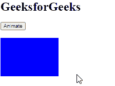

# Angular10 动画动画()功能

> 原文:[https://www . geeksforgeeks . org/angular 10-动画-动画-函数/](https://www.geeksforgeeks.org/angular10-animation-animate-function/)

在本文中，我们将看到 Angular 10 中什么是动画，以及如何使用它。

angular 10 中的 **动画** 用于定义一个动画步骤，该动画步骤将样式信息和时间信息结合在一起

**语法:**

```ts
animate(timings | styles)
```

**模块:**动画使用的模块是:

*   **动画**

**进场:**

*   创建要使用的角度应用程序
*   在 app.module.ts 中导入浏览器动画引擎
*   在 app.component.html 制作一个包含动画元素的 div。
*   在 app.component.ts 中导入要使用的触发器、状态、样式、过渡、动画。
*   使用包含定时和样式的动画()制作动画。
*   使用 ng serve 为 angular app 服务，以查看输出

**参数:**

*   **定时:**为父动画设置动画定时
*   **样式:**为父动画设置动画样式

**返回值:**

*   **animationanimatetadata:**封装动画步骤的对象

**例 1:**

## app.module.ts

```ts
import { LOCALE_ID, NgModule } 
       from '@angular/core';
import { BrowserModule }
       from '@angular/platform-browser';
import {BrowserAnimationsModule}
       from '@angular/platform-browser/animations';
import { AppRoutingModule }
       from './app-routing.module';
import { AppComponent } 
       from './app.component';

@NgModule({
  declarations: [
    AppComponent
  ],
  imports: [
    BrowserModule,
    AppRoutingModule,
    BrowserAnimationsModule
  ],
  providers: [
      { provide: LOCALE_ID, useValue: 'en-GB' },
  ],
  bootstrap: [AppComponent]
})
export class AppModule { }
```

## app.component.ts

```ts
import { trigger, state,
style, transition, animate }
       from '@angular/animations';
import { Component } from '@angular/core';

@Component({
  selector: 'app-root',
  templateUrl: './app.component.html',
  styleUrls: [ './app.component.css' ],
  animations: [
    trigger('gfg',[
      state('normal', style({
        'background-color': 'red',
        transform: 'translateX(0)'
      })),
      state('highlighted', style({
        'background-color': 'blue',
        transform: 'translateX(0)'
      })),
      transition('normal => highlighted',animate(1200)),
      transition('highlighted => normal',animate(1000))
    ])
  ]
})
export class AppComponent  {
  state = 'normal';
  anim(){
    this.state == 'normal' ? 
    this.state = 'highlighted' : this.state = 'normal';
  }
}
```

## app.component.html

```ts
<h1>GeeksforGeeks</h1>
<button (click)='anim()'>Animate</button>
<div 
  style="width: 100px; height: 100px"
  [@gfg]='state'>
</div>
```

**输出:**



**参考:**T2】https://angular.io/api/animations/animate