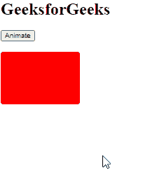

# Angular10 动画过渡 API

> 原文:[https://www . geesforgeks . org/angular 10-动画-过渡-api/](https://www.geeksforgeeks.org/angular10-animation-transition-api/)

在本文中，我们将看到什么是 Angular 10 中的过渡以及如何使用它。

angular 10 中的 **过渡** 用于为动画创建一个过渡，其中一个元素将从状态过渡到另一个状态。

**语法:**

```ts
transition (stateChangeExpr, steps, options)
```

**模块:**过渡使用的模块是:

*   **动画**

**进场:**

*   创建要使用的角度应用程序。
*   在 app.module.ts 中导入浏览器动画引擎。
*   在 app.component.html 制作一个包含动画元素的 div。
*   在 app.component.ts 中导入要使用的触发器、状态、样式、过渡、动画。
*   制作包含动画的 stateChangeExpr、步骤和选项的过渡。
*   使用 ng serve 为 angular app 服务，以查看输出。

**参数:**

*   **状态变化表达式:**一个布尔表达式，用于比较先前的和当前的动画状态。
*   **步骤:** 动画返回的一个或多个动画对象。
*   **选项:** 一个选项对象，可以包含动画开始的延迟值

**返回值:**

*   **动画过渡元数据:** 封装新过渡数据的对象。

**例 1:**

## app.module.ts

```ts
import { LOCALE_ID, NgModule }
from '@angular/core';
import { BrowserModule } 
from '@angular/platform-browser';
import {BrowserAnimationsModule}
from '@angular/platform-browser/animations';
import { AppRoutingModule } 
from './app-routing.module';
import { AppComponent }
from './app.component';

@NgModule({
  declarations: [
    AppComponent
  ],
  imports: [
    BrowserModule,
    AppRoutingModule,
    BrowserAnimationsModule
  ],
  providers: [
      { provide: LOCALE_ID, useValue: 'en-GB' },
  ],
  bootstrap: [AppComponent]
})
export class AppModule { }
```

## app.component.ts

```ts
import { 
  // Transition is imported here
  trigger, 
  state, 
  style, 
  transition, 
  animate } from '@angular/animations';
import { Component } from '@angular/core';

@Component({
  selector: 'app-root',
  templateUrl: './app.component.html',
  styleUrls: [ './app.component.css' ],
  animations: [

    trigger('geek',[     
      state('clr', style({
        'background-color': '#ff0000',
        transform: 'translateX(0)'
      })),
      state('clr1', style({
        'background-color': '#000000',
        transform: 'translateX(100px) translateY(100px) scale(0.3)'
      })),

      // transition is used here 
      transition('clr => clr1',animate(1600)),
      transition('clr1 => clr',animate(100))
    ])
  ]
})
export class AppComponent  {
  state = 'clr';
  anim(){
    this.state == 'clr' ? this.state = 'clr1' : this.state = 'clr';
  }
}
```

## app.component.html

```ts
<h1>GeeksforGeeks</h1>
<button (click)='anim()'>Animate</button>
<br>
<br>
<div 
  style="width: 150px; height: 100px; 
         border-radius: 5px;"
  [@geek]='state'>
</div>
```

**输出:**



**参考:**T2】https://angular.io/api/animations/transition