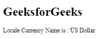

# angular 10 getlocalecurrency name()函数

> 原文:[https://www . geeksforgeeks . org/angular 10-getlocalecurrency name-function/](https://www.geeksforgeeks.org/angular10-getlocalecurrencyname-function/)

在这篇文章中，我们将看到什么是 Angular 10 中的 **getLocaleCurrencyName** 以及如何使用它。

getLocaleCurrencyName 是 用于获取给定地区的货币名称。

**语法:**

```ts
getLocaleCurrencyName(locale: string): string | null

```

**模块:**getlocalecurrencename 使用的模块为:

*   CommonModule

**进场:**

*   创建要使用的角度应用程序
*   在 app.module.ts 中导入 LOCALE_ID，因为我们需要使用 getLocaleCurrencyName 导入区域设置。

```ts
import { LOCALE_ID, NgModule } from '@angular/core';
```

*   在 app.component.ts 中，导入 getLocaleCurrencyName 和 LOCALE_ID
*   注入 LOCALE_ID 作为公共变量，并使用 LOCALE 变量编写获取一周第一天的代码。
*   在 app.component.html，使用字符串插值显示局部变量
*   使用 ng serve 为 angular app 服务，以查看输出。

**参数:**

*   **区域设置:**包含带有规则的区域设置代码的字符串。

**返回值:**

*   **字符串:**包含货币名称的字符串。

**例 1:**

## app.module.ts

```ts
import { LOCALE_ID, NgModule } 
        from '@angular/core';
import { BrowserModule } 
        from '@angular/platform-browser';

import { AppRoutingModule } 
        from './app-routing.module';
import { AppComponent } 
        from './app.component';

@NgModule({
  declarations: [
    AppComponent
  ],
  imports: [
    BrowserModule,
    AppRoutingModule
  ],
  providers: [
      { provide: LOCALE_ID, useValue: 'en-GB' },
  ],
  bootstrap: [AppComponent]
})
export class AppModule { }
```

## app.component.ts

```ts
import {FormStyle,
        getLocaleCurrencyName, 
        TranslationWidth } 
        from '@angular/common';

import {Component, 
        Inject,OnInit, 
        LOCALE_ID } 
        from '@angular/core';

@Component({
    selector: 'app-root',
    templateUrl: './app.component.html'
})
export class AppComponent {
    curr = getLocaleCurrencyName(this.locale);
    constructor(
        @Inject(LOCALE_ID) public locale: string,){}
      }
```

## app.component.html

```ts
<h1>
   GeeksforGeeks
</h1>
<p>Locale Currency Name is : 
   {{curr}}
</p>
```

**输出:**



**例 2:**

## app.module.ts

```ts
import { LOCALE_ID, NgModule }
        from '@angular/core';
import { BrowserModule } 
        from '@angular/platform-browser';

import { AppRoutingModule } 
        from './app-routing.module';
import { AppComponent } 
        from './app.component';

@NgModule({
  declarations: [
    AppComponent
  ],
  imports: [
    BrowserModule,
    AppRoutingModule
  ],
  providers: [
      { provide: LOCALE_ID, useValue: 'en-GB' },
  ],
  bootstrap: [AppComponent]
})
export class AppModule { }
```

## app.component.ts

```ts
import {FormStyle,
        getLocaleCurrencyName, 
        TranslationWidth } 
        from '@angular/common';

import { Component, 
        Inject,OnInit, 
        LOCALE_ID } 
        from '@angular/core';

@Component({
    selector: 'app-root',
    templateUrl: './app.component.html'
})
export class AppComponent {
    curr = getLocaleCurrencyName(this.locale);
    constructor(
        @Inject(LOCALE_ID) public locale: string,){}
      }
```

## app.component.html

```ts
<h1>
   GeeksforGeeks
</h1>
<p>Currency Name is : {{curr}}, 
   example: ( {{100 | currency}})
</p>
```

**输出:**


**参考:**[**https://angular.io/api/common/getLocaleCurrencyName**](https://angular.io/api/common/getLocaleCurrencyName)