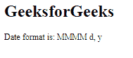

# angular 10 getlocaleedateformat()函数

> 原文:[https://www . geeksforgeeks . org/angular 10-getlocaledateformat-function/](https://www.geeksforgeeks.org/angular10-getlocaledateformat-function/)

在本文中，我们将看到 Angular 10 中什么是**getlocaleedateformat**以及如何使用它。

getLocaleDateFormat 用于获取给定地区的本地化日期值格式。

**语法:**

```
getLocaleDateFormat(locale: string, width: FormatWidth): string
```

**模块:**GetLocaleDateformat 使用的模块是:

*   **公共模块**

**进场:**

*   创建要使用的角度应用程序
*   在 app.module.ts 中导入 LOCALE_ID，因为我们需要使用 getLocaleDateFormat 导入区域设置。

```
import { LOCALE_ID, NgModule } from '@angular/core';
```

*   在 app.component.ts 中，导入 getLocaleDateFormat 和 LOCALE_ID
*   将 LOCALE_ID 作为公共变量注入。
*   在 app.component.html，使用字符串插值显示局部变量
*   使用 ng serve 为 angular app 服务，以查看输出。

**参数:**

*   **区域设置:**包含带有规则的区域设置代码的字符串。
*   **宽度:**格式类型。

**返回值:**

*   **字符串:**本地化格式字符串的字符串。

**例 1:**

## app.module.ts

```
import { LOCALE_ID, NgModule } 
        from '@angular/core';
import { BrowserModule }
        from '@angular/platform-browser';

import { AppRoutingModule } 
        from './app-routing.module';
import { AppComponent } 
        from './app.component';

@NgModule({
  declarations: [
    AppComponent
  ],
  imports: [
    BrowserModule,
    AppRoutingModule
  ],
  providers: [
      { provide: LOCALE_ID, useValue: 'en-GB' },
  ],
  bootstrap: [AppComponent]
})
export class AppModule { }
```

## app.component.ts

```
import {FormStyle,
        getLocaleDateFormat, 
        TranslationWidth, 
        FormatWidth} 
        from '@angular/common';

import {Component, 
        Inject,OnInit, 
        LOCALE_ID } 
        from '@angular/core';

@Component({
    selector: 'app-root',
    templateUrl: './app.component.html'
})
export class AppComponent {
    for = getLocaleDateFormat(this.locale,     
               FormatWidth.Short);
    constructor(
        @Inject(LOCALE_ID) public locale: string,){}
      }
```

## app.component.html

```
<h1>
   GeeksforGeeks
</h1>
<p>Date format is: {{for}}</p>
```

**输出:**


**例 2:**

## app.module.ts

```
import { LOCALE_ID, NgModule } 
        from '@angular/core';
import { BrowserModule } 
        from '@angular/platform-browser';

import { AppRoutingModule } 
        from './app-routing.module';
import { AppComponent } 
        from './app.component';

@NgModule({
  declarations: [
    AppComponent
  ],
  imports: [
    BrowserModule,
    AppRoutingModule
  ],
  providers: [
      { provide: LOCALE_ID, useValue: 'en-GB' },
  ],
  bootstrap: [AppComponent]
})
export class AppModule { }
```

## app.component.ts

```
import {FormStyle,
  getLocaleDateFormat, 
  TranslationWidth, 
  FormatWidth} 
  from '@angular/common';

import {Component,
        Inject, 
        LOCALE_ID } 
        from '@angular/core';

@Component({
    selector: 'app-root',
    templateUrl: './app.component.html'
})
export class AppComponent {
    for = getLocaleDateFormat(this.locale,     
            FormatWidth.Long);
    constructor(
        @Inject(LOCALE_ID) public locale: string,){}
      }
```

## app.component.html

```
<h1>
   GeeksforGeeks
</h1>
<p>Date format is: {{for}}</p>
```

**输出:**



**参考资料:**[](https://angular.io/api/common/getLocaleCurrencyName)**[【https://angular . io/API/common/getlocalateformat】](https://angular.io/api/common/getLocaleDateFormat)**