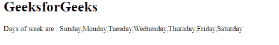
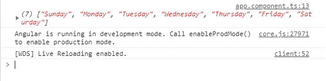

# angular 10 getlocaledynames()函数

> 原文:[https://www . geesforgeks . org/angular 10-getlocaledynames-function/](https://www.geeksforgeeks.org/angular10-getlocaledaynames-function/)

在这篇文章中，我们将看到什么是 Angular 10 中的**getlocaledynames**以及如何使用它。

getLocaleDayNames 用于获取给定区域设置的星期几。

**语法:**

```ts
getLocaleDayNames(
             locale: string, 
             formStyle: FormStyle, 
             width: TranslationWidth
             )
```

**模块:**日名使用的模块是:

*   **公共模块**

**进场:**

*   创建要使用的角度应用程序
*   在 app.module.ts 中导入 LOCALE_ID，因为我们需要使用 getLocaleDayNames 导入区域设置。

```ts
import { LOCALE_ID, NgModule } from '@angular/core';
```

*   在 app.component.ts 导入 FormStyle、getLocaleDayNames、TranslationWidth 和 LOCALE_ID 中
*   注入 LOCALE_ID 作为公共变量，并使用 LOCALE 变量编写获取星期几的代码。
*   在 app.component.html，使用字符串插值显示局部变量
*   使用 ng serve 为 angular app 服务，以查看输出。

**参数:**

*   **地区:**有规则的地区代码。
*   **表单样式:**显示日期的表单样式
*   **宽度:**所取的总宽度。

**返回值:**

*   **阵:**一个阵的天名。

**例 1:**

## app.module.ts

```ts
import { LOCALE_ID, NgModule } from '@angular/core';
import { BrowserModule } from '@angular/platform-browser';

import { AppRoutingModule } from './app-routing.module';
import { AppComponent } from './app.component';

@NgModule({
  declarations: [
    AppComponent
  ],
  imports: [
    BrowserModule,
    AppRoutingModule
  ],
  providers: [
      { provide: LOCALE_ID, useValue: 'en-GB' },
  ],
  bootstrap: [AppComponent]
})
export class AppModule { }
```

## app.component.ts

```ts
import {FormStyle,
        getLocaleDayNames, 
        TranslationWidth } 
        from '@angular/common';

import {Component, 
        Inject,OnInit, 
        LOCALE_ID } 
        from '@angular/core';

@Component({
    selector: 'app-root',
    templateUrl: './app.component.html'
})
export class AppComponent {
    day = getLocaleDayNames(
    this.locale, 
    FormStyle.Standalone, 
    TranslationWidth.Wide
    );
    constructor(
        @Inject(LOCALE_ID) public locale: string,){}
      }
```

## app.component.html

```ts
<h1>
  GeeksforGeeks
</h1>
<p>Days of week are : {{day}}</p>
```

**输出:**



**例 2:**

## app.module.ts

```ts
import { LOCALE_ID, NgModule } from '@angular/core';
import { BrowserModule } from '@angular/platform-browser';

import { AppRoutingModule } from './app-routing.module';
import { AppComponent } from './app.component';

@NgModule({
  declarations: [
    AppComponent
  ],
  imports: [
    BrowserModule,
    AppRoutingModule
  ],
  providers: [
      { provide: LOCALE_ID, useValue: 'en-GB' },
  ],
  bootstrap: [AppComponent]
})
export class AppModule { }
```

## app.component.ts

```ts
import {FormStyle,
        getLocaleDayNames, 
        TranslationWidth } 
        from '@angular/common';

import {Component, 
        Inject, 
        LOCALE_ID } 
        from '@angular/core';

@Component({
    selector: 'app-root',
    templateUrl: './app.component.html'
})
export class AppComponent {
    day = getLocaleDayNames(this.locale, 
    FormStyle.Standalone, 
    TranslationWidth.Wide);
    constructor(
        @Inject(LOCALE_ID) public locale: string,){
            console.log(this.day)
        }
      }
```

**输出:**



**参考:**[**https://angular.io/api/common/getLocaleDayNames**](https://angular.io/api/common/getLocaleDayNames)