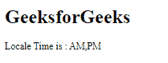

# angular 10 getlocaleDayperiods()函数

> 原文:[https://www . geesforgeks . org/angular 10-getlocaledayperiods-function/](https://www.geeksforgeeks.org/angular10-getlocaledayperiods-function/)

在本文中，我们将看到 Angular 10 中什么是 **getLocaleDayPeriods** 以及如何使用它。

用于获取给定区域设置的日周期字符串的 getLocaleDayPeriods。

**语法:**

```ts
getLocaleDayPeriods(locale: string, 
                    formStyle: FormStyle, 
                    width: TranslationWidth)
```

**模块:**GetLocaleDayperiods 使用的模块是:

*   **公共模块**

**进场:**

*   创建要使用的角度应用程序
*   在 app.module.ts 中导入 LOCALE_ID，因为我们需要使用 getLocaleDayPeriods 导入区域设置。

```ts
import { LOCALE_ID, NgModule } from '@angular/core';
```

*   在 app.component.ts 中导入 getLocaleDayPeriods 和 LOCALE_ID
*   将 LOCALE_ID 作为公共变量注入。
*   在 app.component.html，使用字符串插值显示局部变量
*   使用 ng serve 为 angular app 服务，以查看输出。

**参数:**

*   **区域设置:**包含带有规则的区域设置代码的字符串。
*   **宽度:**字符宽度。
*   **表单样式:**表单样式。

**返回值:**

*   **数组:**本地化周期字符串数组。

**例 1:**

## app.module.ts

```ts
import { LOCALE_ID, NgModule }
        from '@angular/core';
import { BrowserModule } 
        from '@angular/platform-browser';

import { AppRoutingModule } 
        from './app-routing.module';
import { AppComponent } 
        from './app.component';

@NgModule({
  declarations: [
    AppComponent
  ],
  imports: [
    BrowserModule,
    AppRoutingModule
  ],
  providers: [
      { provide: LOCALE_ID, useValue: 'en-GB' },
  ],
  bootstrap: [AppComponent]
})
export class AppModule { }
```

## app.component.ts

```ts
import {FormStyle,
        getLocaleDayPeriods, 
        TranslationWidth } 
        from '@angular/common';

import {Component, 
        Inject, 
        LOCALE_ID } 
        from '@angular/core';

@Component({
    selector: 'app-root',
    templateUrl: './app.component.html'
})
export class AppComponent {
    dir = getLocaleDayPeriods(this.locale, 
                        FormStyle.Standalone, 
                        TranslationWidth.Wide);
    constructor(
        @Inject(LOCALE_ID) public locale: string,){}
      }
```

## app.component.html

```ts
<h1>
   GeeksforGeeks
</h1>
 <p>Locale Time is : {{dir}}</p>
```

**输出:**



**参考:**[](https://angular.io/api/common/getLocaleCurrencyName)**[https://angular.io/api/common/getLocaleDayPeriods](https://angular.io/api/common/getLocaleDayPeriods)**