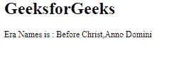

# angular 10 getlocaleenames()函数

> 原文:[https://www . geeksforgeeks . org/angular 10-getlocaleenames-function/](https://www.geeksforgeeks.org/angular10-getlocaleeranames-function/)

在本文中，我们将看到 Angular 10 中的**getlocaleareanames**是什么以及如何使用它。

getLocaleEraNames 是 用于获取给定地区的公历纪元。

**语法:**

```ts
getLocaleEraNames(locale: string, width: TranslationWidth)
```

**模块:**getlocaleenames 使用的模块为:

*   CommonModule

**进场:**

*   创建要使用的角度应用程序
*   在 app.module.ts 中导入 LOCALE_ID，因为我们需要使用 getLocaleEraNames 导入区域设置。

```ts
import { LOCALE_ID, NgModule } from '@angular/core';
```

*   在 app.component.ts 中，导入 getLocaleEraNames 和 LOCALE_ID
*   将 LOCALE_ID 作为公共变量注入。
*   在 app.component.html，使用字符串插值显示局部变量
*   使用 ng serve 为 angular app 服务，以查看输出。

**参数:**

*   **区域设置:**包含带有规则的区域设置代码的字符串。
*   **宽度:**字符宽度。

**返回值:**

*   **阵:**包含纪元名称的阵。

**例 1:**

## app.module.ts

```ts
import { LOCALE_ID, NgModule } 
        from '@angular/core';
import { BrowserModule } 
        from '@angular/platform-browser';

import { AppRoutingModule } 
        from './app-routing.module';
import { AppComponent } 
        from './app.component';

@NgModule({
  declarations: [
    AppComponent
  ],
  imports: [
    BrowserModule,
    AppRoutingModule
  ],
  providers: [
      { provide: LOCALE_ID, useValue: 'en-GB' },
  ],
  bootstrap: [AppComponent]
})
export class AppModule { }
```

## app.component.ts

```ts
import {FormStyle,
        getLocaleEraNames, 
        TranslationWidth } 
        from '@angular/common';

import {Component, 
        Inject,OnInit, 
        LOCALE_ID } 
        from '@angular/core';

@Component({
    selector: 'app-root',
    templateUrl: './app.component.html'
})
export class AppComponent {
    code = getLocaleEraNames(this.locale, 
           TranslationWidth.Wide);
    constructor(
        @Inject(LOCALE_ID) public locale: string,){}
      }
```

## app.component.html

```ts
<h1>
   GeeksforGeeks
</h1>
 <p>Era Names is : {{code}}</p>
```

**输出:**



**例 2:**

## app.module.ts

```ts
import { LOCALE_ID, NgModule } 
        from '@angular/core';
import { BrowserModule } 
        from '@angular/platform-browser';

import { AppRoutingModule } 
        from './app-routing.module';
import { AppComponent } 
        from './app.component';

@NgModule({
  declarations: [
    AppComponent
  ],
  imports: [
    BrowserModule,
    AppRoutingModule
  ],
  providers: [
      { provide: LOCALE_ID, useValue: 'en-GB' },
  ],
  bootstrap: [AppComponent]
})
export class AppModule { }
```

## app.component.ts

```ts
import {FormStyle,
        getLocaleEraNames, 
        TranslationWidth } 
        from '@angular/common';

import {Component, 
        Inject,
        OnInit, 
        LOCALE_ID } 
        from '@angular/core';

@Component({
    selector: 'app-root',
    templateUrl: './app.component.html'
})
export class AppComponent {
    era = getLocaleEraNames(this.locale, 
            TranslationWidth.Wide);
    a='';
    b='';
    constructor(
        @Inject(LOCALE_ID) public locale: string,){
            if(this.era[0]=='Before Christ'){
                this.a='BC';
                this.b='AD';
            }
        }
      }
```

## app.component.html

```ts
<h1>
   GeeksforGeeks
</h1>
 <p>Era Names:
   <li>{{a}}</li>
   <li>{{b}}</li>
 </p>
```

**输出:**


**参考:**[](https://angular.io/api/common/getLocaleCurrencyName)**[https://angular.io/api/common/getLocaleEraNames](https://angular.io/api/common/getLocaleEraNames)**