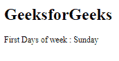
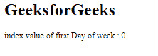

# angular 10 getlocaleeferstdayofweek()函数

> 原文:[https://www . geesforgeks . org/angular 10-getlocalefirstdayofweek-function/](https://www.geeksforgeeks.org/angular10-getlocalefirstdayofweek-function/)

在本文中，我们将看到 Angular 10 中什么是 **getLocaleFirstDayOfWeek** 以及如何使用它。**getlocalefierstdayofweek**用于获取给定地区的一周的第一天。

**语法:**

```
getLocaleFirstDayOfWeek(locale : string): WeekDay

```

**模块:**第一天使用的模块是:

*   **公共模块**

**进场:**

*   创建角度应用程序。
*   在 app.module.ts 中，导入 LOCALE_ID，因为我们需要为使用 getLocaleDayNames 导入区域设置。

```
import { LOCALE_ID, NgModule } from '@angular/core';
```

*   在 app.component.ts 中，导入 getLocaleFirstDayOfWeek 和 LOCALE_ID。
*   注入 LOCALE_ID 作为公共变量，并使用 LOCALE 变量编写获取一周第一天的代码。
*   在 app.component.html，使用字符串插值显示局部变量。
*   使用 ng serve 为 angular app 服务，以查看输出。

**参数:**

*   **地区:**有规则的地区代码。

**返回值:**

*   **编号:**索引从 0 开始。

**例 1:**

## app.module.ts

```
import { LOCALE_ID, NgModule } from '@angular/core';
import { BrowserModule } from '@angular/platform-browser';

import { AppRoutingModule } from './app-routing.module';
import { AppComponent } from './app.component';

@NgModule({
  declarations: [
    AppComponent
  ],
  imports: [
    BrowserModule,
    AppRoutingModule
  ],
  providers: [
      { provide: LOCALE_ID, useValue: 'en-GB' },
  ],
  bootstrap: [AppComponent]
})
export class AppModule { }
```

## app.component.ts

```
import {getLocaleFirstDayOfWeek } from '@angular/common';

import { Component, Inject,OnInit, LOCALE_ID } from '@angular/core';

@Component({
    selector: 'app-root',
    templateUrl: './app.component.html'
})
export class AppComponent {
    day = getLocaleFirstDayOfWeek(this.locale);
    dd = '';
    constructor(
        @Inject(LOCALE_ID) public locale: string,){
            if(this.day==0){
                this.dd = 'Sunday';
            }
        }
}
```

## app.component.html

```
<h1>
  GeeksforGeeks
</h1>

<p>First Days of week : {{dd}}</p>
```

**输出:**



**例 2:**

## app.module.ts

```
import { LOCALE_ID, NgModule } from '@angular/core';
import { BrowserModule } from '@angular/platform-browser';

import { AppRoutingModule } from './app-routing.module';
import { AppComponent } from './app.component';

@NgModule({
  declarations: [
    AppComponent
  ],
  imports: [
    BrowserModule,
    AppRoutingModule
  ],
  providers: [
      { provide: LOCALE_ID, useValue: 'en-GB' },
  ],
  bootstrap: [AppComponent]
})
export class AppModule { }
```

## app.component.ts

```
import {getLocaleFirstDayOfWeek } from '@angular/common';

import { Component, Inject, LOCALE_ID } from '@angular/core';

@Component({
    selector: 'app-root',
    templateUrl: './app.component.html'
})
export class AppComponent {
    day = getLocaleFirstDayOfWeek(this.locale);
    constructor(
        @Inject(LOCALE_ID) public locale: string,){
        }
}
```

## app.component.html

```
<h1>
  GeeksforGeeks
</h1>

<p>index value of first Day of week : {{day}}</p>
```

**输出:**



**参考:**[**https://angular.io/api/common/getLocaleFirstDayOfWeek**](https://angular.io/api/common/getLocaleFirstDayOfWeek)