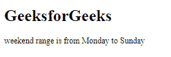

# angular 10 getLocaleWeekEndRange()函数

> 原文:[https://www . geeksforgeeks . org/angular 10-getlocaleweekendrange-function/](https://www.geeksforgeeks.org/angular10-getlocaleweekendrange-function/)

在本文中，我们将看到 Angular 10 中什么是**getLocaleWeekEndRange**以及如何使用它。 **getLocaleWeekEndRange** 用于获取给定地区的星期范围。

**语法:**

```
getLocaleWeekEndRange(locale : string): [WeakDay, WeakDay]

```

**模块:**getLocaleWeekEndRange 使用的模块为:

*   **公共模块**

**进场:**

*   创建一个角度应用。
*   在 app.module.ts 中，导入 LOCALE_ID，因为我们需要为使用 getLocaleWeekEndRange 导入 LOCALE。

```
import { LOCALE_ID, NgModule } from '@angular/core';
```

*   在 app.component.ts 中，导入 getLocaleWeekEndRange 和 LOCALE_ID。
*   注入 LOCALE_ID 作为公共变量，并使用 LOCALE 变量编写获取一周第一天的代码。
*   在 app.component.html，使用字符串插值显示局部变量。
*   使用 ng serve 为 angular app 服务，以查看输出。

**参数:**

*   **区域设置:**包含带有规则的区域设置代码的字符串。

**返回值:**

*   **数组:**包含结束日和开始日的数组。

**例 1:**

## app.module.ts

```
import { LOCALE_ID, NgModule } from '@angular/core';
import { BrowserModule } from '@angular/platform-browser';

import { AppRoutingModule } from './app-routing.module';
import { AppComponent } from './app.component';

@NgModule({
  declarations: [
    AppComponent
  ],
  imports: [
    BrowserModule,
    AppRoutingModule
  ],
  providers: [
      { provide: LOCALE_ID, useValue: 'en-GB' },
  ],
  bootstrap: [AppComponent]
})
export class AppModule { }
```

## app.component.ts

```
import {getLocaleWeekEndRange } from '@angular/common';

import { Component, Inject,OnInit, LOCALE_ID } from '@angular/core';

@Component({
    selector: 'app-root',
    templateUrl: './app.component.html'
})
export class AppComponent {
    rn = getLocaleWeekEndRange(this.locale);
    constructor(
        @Inject(LOCALE_ID) public locale: string,){}
}
```

## app.component.html

```
<h1>
  GeeksforGeeks
</h1>

<p>weekend range: {{rn}}</p>
```

**输出:**


**例 2:**

## app.module.ts

```
import { LOCALE_ID, NgModule } from '@angular/core';
import { BrowserModule } from '@angular/platform-browser';

import { AppRoutingModule } from './app-routing.module';
import { AppComponent } from './app.component';

@NgModule({
  declarations: [
    AppComponent
  ],
  imports: [
    BrowserModule,
    AppRoutingModule
  ],
  providers: [
      { provide: LOCALE_ID, useValue: 'en-GB' },
  ],
  bootstrap: [AppComponent]
})
export class AppModule { }
```

## app.component.ts

```
import {getLocaleWeekEndRange } from '@angular/common';

import { Component, Inject, LOCALE_ID } from '@angular/core';

@Component({
    selector: 'app-root',
    templateUrl: './app.component.html'
})
export class AppComponent {
    rn = getLocaleWeekEndRange(this.locale);
    d1='';
    d2='';
    constructor(
        @Inject(LOCALE_ID) public locale: string,){
            if(this.rn[0] == 6 && this.rn[1] == 0){
                this.d1 = 'Monday';
                this.d2 = 'Sunday';
            }
        }
}
```

## app.component.html

```
<h1>
  GeeksforGeeks
</h1>

<p>weekend range is from {{d1}} to {{d2}}</p>
```

**输出:**



**参考:**T2】https://angular.io/api/common/getLocaleWeekEndRange