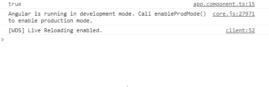
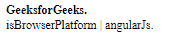

# Angular10 isPlatformBrowser()功能

> 原文:[https://www . geeksforgeeks . org/angular 10-isplatformbrowser-function/](https://www.geeksforgeeks.org/angular10-isplatformbrowser-function/)

在本文中，我们将看到什么是 Angular 10 中的 **isPlatformBrowser** 以及如何使用它。

isPlatformBrowser 用于获取表示浏览器平台的平台 id

**语法:**

```
isPlatformBrowser(platformId);
```

**模块:**isPlatformBrowser 使用的模块为:

*   **公共模块**

**返回值:**返回一个布尔值，说明平台 id 是否代表浏览器平台。

**进场:**

*   创建要使用的角度应用程序
*   将 isPlatformBrowser 从@angular/core 导入项目。
*   在 app.component.ts 中，定义保存布尔值的对象。
*   使用 ng serve 为 angular app 服务，以查看输出

**例 1:**

## app.component.ts

```
import { Component, Inject } 
from '@angular/core';
import { PLATFORM_ID } 
from '@angular/core';
import { isPlatformBrowser }
from '@angular/common';

@Component({
  selector: 'app-root',
  templateUrl: './app.component.html',
  styleUrls: [ './app.component.css' ]
})
export class AppComponent  {
  isBrowser: boolean;

  constructor( @Inject(PLATFORM_ID) platformId: Object) {
    this.isBrowser = isPlatformBrowser(platformId);
    console.log(this.isBrowser)
  }
}
```

**输出:**



**例 2:**

## app.component.ts

```
import { Component, Inject } 
from '@angular/core';
import { PLATFORM_ID }
from '@angular/core';
import { isPlatformBrowser } 
from '@angular/common';

@Component({
  selector: 'app-root',
  templateUrl: './app.component.html',
  styleUrls: [ './app.component.css' ]
})
export class AppComponent  {
    isB: boolean;

    constructor( @Inject(PLATFORM_ID) platformId: Object) {
      this.isB = isPlatformBrowser(platformId);

    }
}
```

## app.component.html

```
<div *ngIf='isB'><strong>GeeksforGeeks.</strong></div>

<div *ngIf='isB'>isBrowserPlatform | angularJs.</div>
```

**输出:**



**参考:**T2】https://angular.io/api/common/isPlatformBrowser