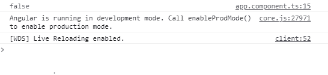
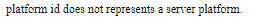

# Angular10 isPlatformServer()函数

> 原文:[https://www . geeksforgeeks . org/angular 10-isplatformserver-function/](https://www.geeksforgeeks.org/angular10-isplatformserver-function/)

在本文中，我们将看到什么是 Angular 10 中的 **isPlatformServer** 以及如何使用它。

isPlatformServer 用于获取代表服务器平台的平台 id

**语法:**

```
isPlatformServer(platformId);
```

**模块:**isPlatformServer 使用的模块是:

*   **公共模块**

**返回值:**返回一个布尔值，说明一个平台 id 是否代表一个服务器平台。

**进场:**

*   创建要使用的角度应用程序
*   将 isPlatformServer 从@angular/core 导入项目。
*   在 app.component.ts 中，定义保存布尔值的对象。
*   使用 ng serve 为 angular app 服务，以查看输出

**例 1:**

## app.component.ts

```
import { Component, Inject } 
from '@angular/core';
import { PLATFORM_ID } 
from '@angular/core';
import { isPlatformServer }
from '@angular/common';

@Component({
  selector: 'app-root',
  templateUrl: './app.component.html',
  styleUrls: [ './app.component.css' ]
})
export class AppComponent  {
    isServer: boolean;

    constructor( @Inject(PLATFORM_ID) platformId: Object) {
      this.isServer = isPlatformServer(platformId);
      console.log(this.isServer);
    }

}
```

**输出:**



**例 2:**

## app.component.ts

```
import { Component, Inject } 
from '@angular/core';
import { PLATFORM_ID } 
from '@angular/core';
import { isPlatformServer } 
from '@angular/common';

@Component({
  selector: 'app-root',
  templateUrl: './app.component.html',
  styleUrls: [ './app.component.css' ]
})
export class AppComponent  {
    isServer: boolean;

    constructor( @Inject(PLATFORM_ID) platformId: Object) {
      this.isServer = isPlatformServer(platformId);
    }

}
```

## " > app.component.html "

```
<div *ngIf = 'isServer==false'>
  platform id does not represents a server platform.
</div>
```

**输出:**



**参考:**T2】https://angular.io/api/common/isPlatformServer