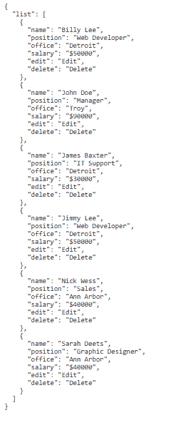

# 角 10 JsonPipe

> 原文:[https://www.geeksforgeeks.org/angular10-jsonpipe/](https://www.geeksforgeeks.org/angular10-jsonpipe/)

在本文中，我们将看到什么是 Angular 10 中的 **JsonPipe** 以及如何使用它。

JsonPipe 用于将对象转换为其 JSON 表示

**语法:**

```
{{ value | json}}
```

**模块:**JSonPipe 使用的模块是:

*   **公共模块**

**进场:**

*   创建要使用的角度应用程序
*   使用 JsonPipe 不需要任何导入
*   在 app.component.ts 中，定义接受 JsonPipe 值的变量。
*   在 app.component.html，使用上面带有“|”符号的语法来创建 JsonPipe 元素。
*   使用 ng serve 为 angular app 服务，以查看输出

**输入值:**

*   **值:**要转换为 JSON 格式字符串的任何类型的值

**例 1:**

## app.component.ts

```
import { Component }
from '@angular/core';

@Component({
    selector: 'app-root',
    templateUrl: './app.component.html'
})
export class AppComponent {
    // JSON object 
    emp: Object = {
        "list":[
        {
            "name":"Billy Lee",
            "position":"Web Developer",
            "office":"Detroit",
            "salary":"$50000",
            "edit":"Edit",
            "delete":"Delete"

        },
        {
            "name":"John Doe",
            "position":"Manager",
            "office":"Troy",
            "salary":"$90000",
            "edit":"Edit",
            "delete":"Delete"
        },
        {
            "name":"James Baxter",
            "position":"IT Support",
            "office":"Detroit",
            "salary":"$30000",
            "edit":"Edit",
            "delete":"Delete"
        },
        {
            "name":"Jimmy Lee",
            "position":"Web Developer",
            "office":"Detroit",
            "salary":"$50000",
            "edit":"Edit",
            "delete":"Delete"
        },
        {
            "name":"Nick Wess",
            "position":"Sales",
            "office":"Ann Arbor",
            "salary":"$40000",
            "edit":"Edit",
            "delete":"Delete"
        },
        {
            "name":"Sarah Deets",
            "position":"Graphic Designer",
            "office":"Ann Arbor",
            "salary":"$40000",
            "edit":"Edit",
            "delete":"Delete"
        }
        ]
}
  }
```

## app.component.html

```
<div>
   <pre>{{emp | json}}</pre>
 </div>
```

**输出:**



**参考:**T2】https://angular.io/api/common/JsonPipe