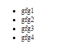
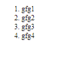

# Angular10 神经生长因子指令

> 原文:[https://www.geeksforgeeks.org/angular10-ngfor-directive/](https://www.geeksforgeeks.org/angular10-ngfor-directive/)

在本文中，我们将看到 Angular 10 中 **NgFor** 是什么以及如何使用它。

NgFor 用作结构指令，为给定集合呈现每个元素，每个元素都可以显示在页面上。

**语法:**

```
<li *ngFor='condition'></li>
```

**模块:**NgForOf 使用的模块为:

*   **公共模块**

**选择器:**

*   **【ngfor】**

**进场:**

*   创建要使用的角度应用程序
*   使用神经生长因子不需要任何导入
*   在 app.component.ts 中，定义要与 ngFor 指令一起使用的数组。
*   在 app.component.html，使用带有列表元素 NgFor 指令来显示数组元素。
*   使用 ng serve 为 angular app 服务，以查看输出

**例 1:**

## app.component.ts

```
import { Component } from '@angular/core';

@Component({
  selector: 'app-root',
  templateUrl: './app.component.html',
})
export class AppComponent  {
  a=['gfg1', 'gfg2', 'gfg3', 'gfg4']
}
```

## app.component.html

```
<ul>
  <li *ngFor='let i of a'> {{i}} </li>
</ul>
```

**输出:**



**例 2:**

## app.component.ts

```
import { Component } from '@angular/core';

@Component({
  selector: 'app-root',
  templateUrl: './app.component.html',
})
export class AppComponent  {
  a=['gfg1', 'gfg2', 'gfg3', 'gfg4']
}
```

## app.component.html

```
<ol>
    <li *ngFor='let i of a'> {{i}} </li>
</ol>
```

**输出:**



**参考:**T2】https://angular.io/api/common/NgForOf