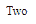

# 角度 10 开关指令

> 原文:[https://www.geeksforgeeks.org/angular10-ngswitch-directive/](https://www.geeksforgeeks.org/angular10-ngswitch-directive/)

在本文中，我们将了解 Angular 10 中的 NgSwitch 是什么以及如何使用它。

angular 10 中的 **开关** 用于指定显示或隐藏子元素的条件。

**语法:**

```
<li *NgSwitch='condition'></li>
```

**模块:**开关使用的模块是:

*   **公共模块**

**选择器:**

*   **【ng witch】**

**Directives:**

*   **NgSwitchCase**

    **进场:**

    *   创建要使用的角度应用程序
    *   使用 nsswitch 不需要任何导入
    *   在 app.component.ts 中定义一个变量
    *   在 app.component.html，在需要检查条件的元素中使用带有 NgSwitchCase 指令的 NgSwitch
    *   使用 ng serve 为 angular app 服务，以查看输出

    **示例:**

    ## app.component.ts

    ```
    import { Component, Inject } 
    from '@angular/core';
    import { PLATFORM_ID } 
    from '@angular/core';
    import { isPlatformWorkerApp } 
    from '@angular/common';

    @Component({
      selector: 'app-root',
      templateUrl: './app.component.html',
      styleUrls: [ './app.component.css' ]
    })
    export class AppComponent  {
      num = 2;
    }
    ```

    ## app.component.html

    ```
    <div [ngSwitch]="num">
      <div *ngSwitchCase="'1'">One</div>
      <div *ngSwitchCase="'2'">Two</div>
      <div *ngSwitchCase="'3'">Three</div>
      <div *ngSwitchCase="'4'">Four</div>
      <div *ngSwitchCase="'5'">Five</div>
    </div>
    ```

    **输出:**

    

    **参考:**T2】https://angular.io/api/common/NgSwitch