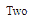

# Angular10 NgSwitchCase 指令

> 原文:[https://www . geeksforgeeks . org/angular 10-ngswitchcase-指令/](https://www.geeksforgeeks.org/angular10-ngswitchcase-directive/)

在本文中，我们将了解 Angular 10 中的 NgSwitchCase 是什么以及如何使用它。

angular 10 中的 **切换案例** 用于 c 创建一个视图，当给定的表达式与表达式匹配时，该视图将从父视图中添加或删除

**语法:**

```ts
<li *NgSwitchCase='condition'></li>
```

**NgSwitchCase 使用的模块:**模块为:

*   **公共模块**

**选择器:**

*   **【NgSwitchCase】**

**进场:**

*   创建要使用的角度应用程序
*   不需要任何导入就可以使用 NgSwitchCase
*   在 app.component.ts 中定义一个变量
*   在 app.component.html，在需要检查条件的元素中使用带有 NgSwitchCase 指令的 NgSwitch
*   使用 ng serve 为 angular app 服务，以查看输出

**例 1:**

## app.component.ts

```ts
import { Component } 
from '@angular/core';

@Component({
  selector: 'app-root',
  templateUrl: './app.component.html',
  styleUrls: [ './app.component.css' ]
})
export class AppComponent  {
  num = 2;
}
```

## app.component.html

```ts
<div [ngSwitch]="num">
  <div *ngSwitchCase="'1'">One</div>
  <div *ngSwitchCase="'2'">Two</div>
  <div *ngSwitchCase="'3'">Three</div>
  <div *ngSwitchCase="'4'">Four</div>
  <div *ngSwitchCase="'5'">Five</div>
</div>
```

**输出:**



**参考:**T2】https://angular.io/api/common/NgSwitchCase