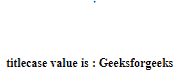
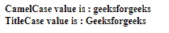

# Angular10 标题套管

> 原文:[https://www.geeksforgeeks.org/angular10-titlecasepipe/](https://www.geeksforgeeks.org/angular10-titlecasepipe/)

在本文中，我们将看到什么是 Angular 10 中的 **TitleCasePipe** 以及如何使用它。

TitleCasePipe 用于将所有文本转换为 titlecase。

**语法:**

```ts
{{ value | TitleCasePipe }}
```

**模块:**title casepipe 使用的模块是:

*   **公共模块**

**进场:**

*   创建要使用的角度应用程序
*   不需要为要使用的 TitleCasePipe 进行任何导入
*   在 app.component.ts 中，定义接受 TitleCasePipe 值的变量。
*   在 app.component.html，使用上面带有“|”符号的语法来创建 TitleCasePipe 元素。
*   使用 ng serve 为 angular app 服务，以查看输出

**输入值:**

*   **值:**取一个字符串值。

**例 1:**

## app.component.ts

```ts
import { Component, OnInit } from '@angular/core';

@Component({
    selector: 'app-root',
    templateUrl: './app.component.html'
})
export class AppComponent {
    // Key Value object
    value : string = 'geeksforgeeks';
  }
```

## app.component.html

```ts
<b>
  <div>
    titlecase value is : {{value | titlecase}}
  </div>
</b>
```

**输出:**



**例 2:**

## app.component.ts

```ts
import { Component, OnInit } from '@angular/core';

@Component({
    selector: 'app-root',
    templateUrl: './app.component.html'
})
export class AppComponent {
    // Key Value object
    value : string = 'geeksforgeeks';
  }
```

## app.component.html

```ts
<b>
  <div>
    CamelCase value is : {{value}}
  </div>
  <div>
    TitleCase value is : {{value |titlecase}}
  </div>
</b>
```

**输出:**



**参考:**T2】https://angular.io/api/common/TitleCasePipe