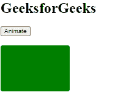

# 角度 10 触发动画

> 原文:[https://www.geeksforgeeks.org/angular10-trigger-animation/](https://www.geeksforgeeks.org/angular10-trigger-animation/)

在本文中，我们将看到 Angular 10 中什么是触发器，以及如何使用它。

angular 10 中的 **触发器** 用于创建包含动画状态和过渡的动画触发器。

**语法:**

```
animate(name | definations)
```

**模块:**触发器使用的模块为:

*   **动画**

**进场:**

*   创建一个要使用的角度应用程序。
*   在 app.module.ts 中，导入浏览器动画引擎。
*   在 app.component.html，制作一个包含动画元素的 div。
*   在 app.component.ts 中，导入要使用的触发器、状态、样式、过渡、动画。
*   制作包含动画状态和过渡的触发器。
*   使用 ng serve 为 angular app 服务，以查看输出。

**参数:**

*   **名称:**设置识别字符串。
*   **定义:**设置动画定义对象。

**返回值:**

*   **AnimationTriggerMetadata:**封装触发器数据的对象。

**示例:**

## app.module.ts

```
import { LOCALE_ID, NgModule } 
from '@angular/core';

import { BrowserModule }
from '@angular/platform-browser';
import {BrowserAnimationsModule} 
from '@angular/platform-browser/animations';
import { AppRoutingModule }
from './app-routing.module';
import { AppComponent }
from './app.component';

@NgModule({
  declarations: [
    AppComponent
  ],
  imports: [
    BrowserModule,
    AppRoutingModule,
    BrowserAnimationsModule
  ],
  providers: [
      { provide: LOCALE_ID, useValue: 'en-GB' },
  ],
  bootstrap: [AppComponent]
})
export class AppModule { }
```

## app.component.ts

```
import { 
  // Trigger is imported here
  trigger, 
  state, 
  style, 
  transition, 
  animate } from '@angular/animations';
import { Component } from '@angular/core';

@Component({
  selector: 'app-root',
  templateUrl: './app.component.html',
  styleUrls: [ './app.component.css' ],
  animations: [

    // Trigger is used here
    trigger('geek',[
      state('green', style({
        'background-color': 'green',
        transform: 'translateX(0)'
      })),
      state('blu', style({
        'background-color': '#49eb34',
        transform: 'translateX(0)'
      })),
      transition('green => blu',animate(1200)),
      transition('blu => green',animate(1000))
    ])
  ]
})
export class AppComponent  {
  state = 'green';
  anim(){
    this.state == 'green' ?
    this.state = 'blu' : this.state = 'green';
  }
}
```

## app.component.html

```
<h1>GeeksforGeeks</h1>
<button (click)='anim()'>Animate</button>
<br>
<br>
<div 
  style="width: 150px; height: 100px; border-radius: 5px;"
  [@geek]='state'>
</div>
```

**输出:**



**参考:**T2】https://angular.io/api/animations/trigger