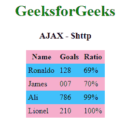

> 原文:[https://www.geeksforgeeks.org/angularjs-ajax-http/](https://www.geeksforgeeks.org/angularjs-ajax-http/)

AngularJS 提供了一个名为 AJAX –$ http 的控制服务，它负责读取远程服务器上所有可用的数据。当服务器使用浏览器进行数据库调用时，就满足了对所需记录的需求。数据大多需要 JSON 格式。这主要是因为对于传输数据来说，JSON 是一种亚马逊方法，而且在 AngularJS、JavaScript 等中使用也很简单。

**语法:**

```
function studentController($scope,$https:) {
   var url = "data.txt";

   $https:.get(url).success( function(response) {
      $scope.students = response; 
   });
}

```

**方法:**有很多方法可以用来调用$http service，这也是调用$http service 的快捷方法。

*   **。post()**
*   **。get()**
*   **。头()**
*   **。jsonp()**
*   **。patch()**
*   **。删除()**
*   **。put()**

**属性:**借助这些属性，来自服务器的响应就是一个对象。

*   **。标题:**获取标题信息(函数)。
*   **。状态文本:**定义 HTTP 状态(字符串)。
*   **。状态:**定义 HTTP 状态(一个数字)。
*   **。数据:**携带服务器的响应(字符串/对象)。
*   **。配置:**生成请求(一个对象)。

**示例:**首先，我们将有一个包含我们的数据的文件。对于这个例子，我们有文件 data.txt，它将包括学生的记录。$http 服务将发出一个 ajax 调用。这将转移&对学生的优先反应。提取后，表格将在基于学生模型的 HTML 中绘制。

*   **数据. txt** 文件:

    ```
    [
       {
          "Name" : "Ronaldo",
          "Goals" : 128,
          "Ratio" : "69%"
       },
       {
          "Name" : "James",
          "Goals" : 007,
          "Ratio" : "70%"
       },
       {
          "Name" : "Ali",
          "Goals" : 786,
          "Ratio" : "99%"
       },
       {
          "Name" : "Lionel ",
          "Goals" : 210,
          "Ratio" : "100%"
       }
    ]

    ```

    *   **代号:**

    ```
    <!DOCTYPE html>
    <html>

    <head>
        <title>AngularJS AJAX - $http</title>
        <style>
            table, th, td {
                        border: 1px #2E0854;
                        border-collapse: collapse;
                        padding: 5px;
                     }

                     table tr:nth-child(odd) {
                        background-color: #F6ADCD;
                     }

                     table tr:nth-child(even) {
                        background-color: #42C0FB;
                     }
        </style>
        <script src=
    "https://ajax.googleapis.com/ajax/libs/angularjs/1.2.15/angular.min.js">
        </script>
    </head>
    <body>
       <center>
          <h1 style="color:green">GeeksforGeeks</h1>
          <h3>AJAX - $http</h>
          <div ng-app="" ng-controller="studentController">
             <table>
                 <tr>
                    <th>Name</th>
                    <th>Goals</th>
                    <th>Ratio</th>
                 </tr>
                 <tr ng-repeat="student in students">
                    <td>{{ Player.Name }}</td>
                    <td>{{ Player.Goals}}</td>
                    <td>{{ Player.Ratio}}</td>
                 </tr>
             </table>
          </div>
          <script>
                function studentController($scope, $http) {
                            var url = "/data.txt";

                            $http.get(url).then( function(response) {
                               $scope.students = response.data;
                            });
                         }
          </script>
       </center>
    </body>

    </html>
    ```

    *   **输出:**
    