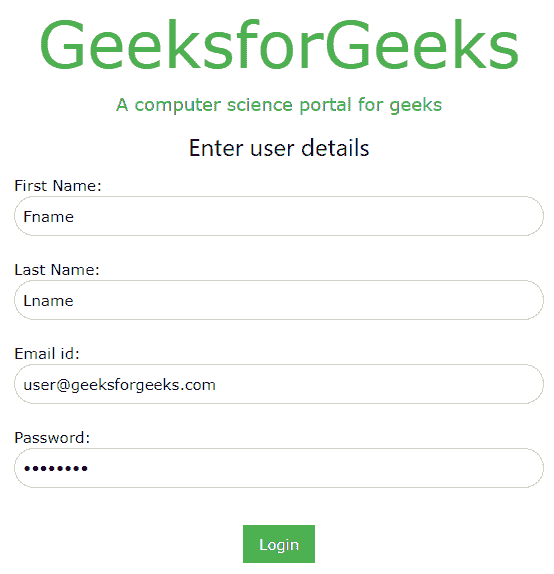

# AngularJS 和 W3。CSS

> 原文:[https://www.geeksforgeeks.org/angularjs-and-w3-css/](https://www.geeksforgeeks.org/angularjs-and-w3-css/)

**什么是 W3。CSS？**

*   W3。CSS 是一个现代框架，与其他 CSS 框架相比，它具有内置的响应性，并且易于学习和使用。
*   其目标是加快和简化网络开发，并支持现代响应设备，如移动设备、笔记本电脑、平板电脑和台式机
*   W3。CSS 旨在作为 Bootstrap 的高质量替代品，由 w3school.com 开发

**什么是 angularJS？**

*   AngularJS 是一个动态网络应用的结构框架，它用新的属性扩展了 HTML。
*   它提供自动化测试，非常适合单页应用程序
*   它给应用程序一个干净的结构和大量可重用的代码。

**W3 最重要的部分。CSS :**

1.  w3-container:向任何 HTML 元素添加 16px 左右填充。
2.  w3-fontSize : w3-tiny、w3-small、w3-medium(默认)、w3-large、w3-xlarge、w3-xlarge、w3-xxlarge、w3-xxxlarge、w3-jumbo。
3.  w3-text:它提供了 css 特性，如对齐、不透明度、阴影、特殊效果。
4.  w3-input:它提供输入卡、彩色标签、边框、复选框、单选按钮等

**示例:**

## 超文本标记语言

```
<!DOCTYPE html>
<html>
<head>
    <link rel="stylesheet"
          href="https://www.w3schools.com/w3css/4/w3.css">
    <script src=
"https://ajax.googleapis.com/ajax/libs/angularjs/1.6.9/angular.min.js">
    </script>
    <style>

    .pad {
        margin: 0 0 0 0;
    }
    </style>

</head>

<body ng-app="myApp" ng-controller="myCtrl">

    <div class="w3-container ">

    <p class="w3-jumbo w3-text-green pad"
       align="center">GeeksforGeeks</p>

    <p class="w3-large w3-text-green pad"
       align="center" >
     A computer science portal for geeks</p>

    <form>

        <h3 align="center" > Enter user details </h3>

        <label>First Name:</label>
        <input class="w3-input w3-border w3-round-xxlarge"
               type="text"
               ng-model="fname" 
               placeholder="First Name"></br>

        <label>Last Name:</label>
        <input class="w3-input w3-border  w3-round-xxlarge"
               type="text"
               ng-model="lname" 
               placeholder="Last Name"></br>

        <label>Email id:</label>
        <input class="w3-input w3-border  w3-round-xxlarge"
               type="email"
               ng-model="mail"
               placeholder="Email id"></br>

        <label>Password:</label>
        <input class="w3-input w3-border  w3-round-xxlarge"
               type="password"
               ng-model="pass" 
               placeholder="Password"></br>

        <p align="center">
        <button class="w3-btn w3-green w3-ripple " >
              Save </button></p>

    </form>

    <script>
        var app = angular.module('myApp', []);
        app.controller('myCtrl', function($scope) {
              $scope.fname = "Fname";
              $scope.lname = "Lname";
              $scope.mail = "user@geeksforgeeks.com";
              $scope.pass = "password";
        });
    </script>
</body>
</html>
```

**输出:**



GeeksforGeeks 登录页