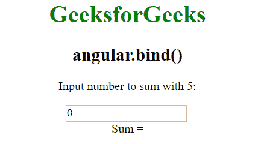
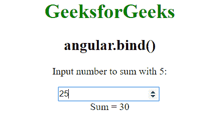
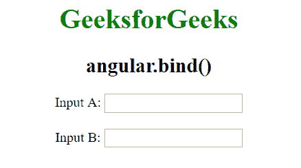
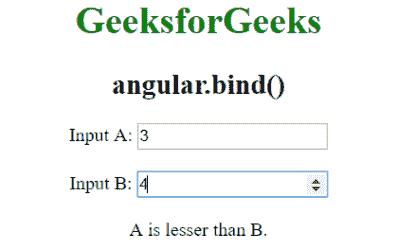

# AngularJS | angular.bind()函数

> 原文:[https://www . geeksforgeeks . org/angular js-angular-bind-function/](https://www.geeksforgeeks.org/angularjs-angular-bind-function/)

AngularJS 中的 **angular.bind()函数**用于将当前上下文绑定到一个函数，但实际上是在以后执行它。也可用于**部分应用**。部分应用程序是当你想要创建一个函数，但是一些参数已经被传递了。
**语法:**

```
angular.bind(self, function, args);
```

**参数值:**

*   **self:** 这是指应该评估功能的上下文。
*   **函数:**指要绑定的函数。
*   **args:** 用于在函数调用时预绑定到函数。这是一个可选的参数。

**例 1:**

## 超文本标记语言

```
<html>
   <head>
      <title>angular.bind()</title>
      <script src=
         "https://ajax.googleapis.com/ajax/libs/angularjs/1.5.6/angular.min.js">
      </script>
   </head>

   <body ng-app="app" style="text-align:Center">

      <h1 style="color:green">GeeksforGeeks</h1>

      <h2>angular.bind()</h2>

<p>Input number to sum with 5:
      <div ng-controller="geek">
         <input type="number" ng-model="num" ng-change="Func()" />
         <br>Sum = {{Add}}
      </div>

      <script>
         var app = angular.module("app", []);
         app.controller('geek', ['$scope', function ($scope) {
             $scope.num = 0;
             $scope.Func = function () {
                 var add = angular.bind(this, function (a, b) {
                     return a + b;
                 });
                 $scope.Add = add(5, $scope.num);
             }
         }]);

      </script>
   </body>
</html>
```

**输出:**
**输入前:**



**输入后:**



**例 2:**

## 超文本标记语言

```
<html>
   <head>
      <title>angular.bind()</title>
      <script src=
          "https://ajax.googleapis.com/ajax/libs/angularjs/1.5.6/angular.min.js">
      </script>
   </head>

   <body ng-app="app" style="text-align:Center">

      <h1 style="color:green">GeeksforGeeks</h1>

      <h2>angular.bind()</h2>

      <div ng-controller="geek">
         Input A:
         <input type="number" ng-model="val1" ng-change="GetResult()" />
         <br><br>
         Input B:
         <input type="number" ng-model="val2" ng-change="GetResult()" />
         <br /><br>
         {{result}}
      </div>

      <script>
         var app = angular.module("app", []);
         app.controller('geek', ['$scope', function ($scope) {
             function isEqual(a, b) {
                 if (a == b) {
                     return "Inputs are equal."
                 }
                 else if (a >= b) {
                     return "A is greater than B."
                 }
                 else if (a <= b) {
                     return "A is lesser than B."
                 }
             }
             $scope.GetResult = function () {
                 var result = angular.bind(this, isEqual);
                 $scope.result = result($scope.val1, $scope.val2);
             }
         }]);

      </script>
   </body>
</html>
```

**输出:**
**输入前:**



**输入后:**

