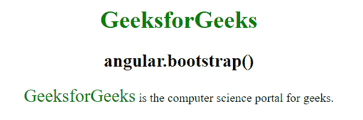
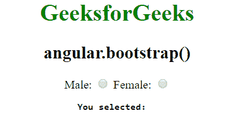
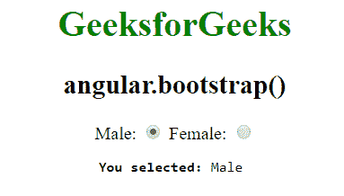

# AngularJS | angular.bootstrap()函数

> 原文:[https://www . geeksforgeeks . org/angular js-angular-bootstrap-function/](https://www.geeksforgeeks.org/angularjs-angular-bootstrap-function/)

angularJS 中的 **angular.bootstrap()函数**是 Core ng 模块中的一个功能组件，用于手动启动 Angular 应用程序，它提供了对应用程序初始化的更多控制。
**语法:**

```ts
angular.bootstrap(element, [modules], [config])
```

**参数值:**

*   **元素:**元素是一个 DOM 元素(例如文档)，它是 Angular 应用程序的根。
*   **模块:**(可选)模块是要加载的模块阵列。
*   **配置:**(可选)配置是用于配置选项的对象。

**例 1:**

```ts
<html>
    <head>
        <title>angular.bootstrap()</title>
        <script src=
        "https://ajax.googleapis.com/ajax/libs/angularjs/1.5.6/angular.min.js"> 
        </script>
        <style>
        .id {
        font-size: 1.5em;
        color:green;
        }
        </style>
    </head>
    <body ng-app="app" style="text-align:Center">
        <h1 style="color:green">GeeksforGeeks</h1>
        <h2>angular.bootstrap()</h2>
        <div ng-controller="geek">
        <span class="id">{{name}}</span> 
        is the computer science portal for geeks.
        </div>
        <script>
            var app = angular.module("app", []);
            app.controller('geek', ['$scope', function ($scope) {
                $scope.name = "GeeksforGeeks";
            }]);
            angular.bootstrap(document, ['app']);
        </script>
    </body>
</html>
```

**输出:**


**例 2:**

```ts
</div>

<html>
    <head>
        <title>angular.bootstrap()</title>
        <script src=
        "https://ajax.googleapis.com/ajax/libs/angularjs/1.5.6/angular.min.js"> 
        </script>
    </head>
    <body ng-app="app" style="text-align:Center">
        <h1 style="color:green">GeeksforGeeks</h1>
        <h2>angular.bootstrap()</h2>
        <div ng-controller="geek">
            <div class="col-md-3 well" ng-init="count=0">
                Male:    
                <input type="radio" ng-model="gender" value="Male" 
                ng-change="layout(gender)" />
                Female:  
                <input type="radio" ng-model="gender" value="Female" 
                ng-change="layout(gender)" />
                <pre><b>You selected:</b> {{result}} </pre>
            </div>
        </div>
        <script>
            var app = angular.module("app", []);
            app.controller('geek', ['$scope', function ($scope) {
                $scope.layout = function (gender) {
                    $scope.result = gender;
                }
            }]);
            angular.bootstrap(document, ['app']);
        </script>
    </body>
</html>
```

**输出:**
**选择前:**

**选择后:**
