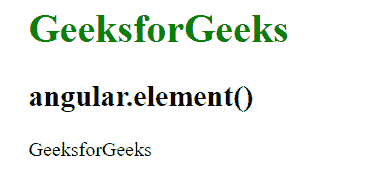
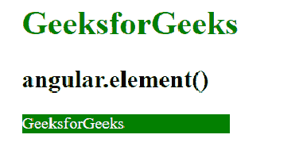
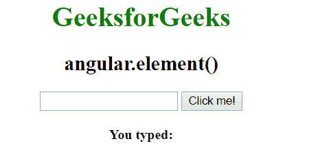
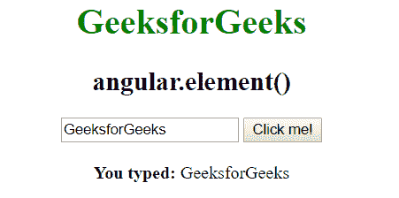

# AngularJS | angular.element()函数

> 原文:[https://www . geeksforgeeks . org/angular js-angular-element-function/](https://www.geeksforgeeks.org/angularjs-angular-element-function/)

AngularJS 中的 **angular.element()函数**用于*将 DOM 元素或 HTML 字符串初始化为 jQuery 元素*。如果 jQuery 可用 **angular.element** 可以用作 jQuery 函数的别名，也可以用作在 angular 的 **jqlite** 中包装元素或字符串的函数。

**语法:**

```ts
angular.element(element)
```

其中**元素**指的是要包装到 jQuery 中的 HTML DOM 元素或字符串。

**示例-1:**

```ts
<!DOCTYPE html>
<html>

<head>
    <script src=
"//ajax.googleapis.com/ajax/libs/angularjs/1.3.2/angular.min.js">
    </script>
    <title>
      angular.element()
  </title>
</head>

<body ng-app="app">
    <h1 style="color:green">
      GeeksforGeeks
  </h1>
    <h2>
      angular.element()
  </h2>

    <div ng-controller="geek">
        <div ng-mouseenter="style()"
             id="ide" 
             ng-mouseleave="remove()">
            {{name}}
        </div>
    </div>
    <script>
        var app = angular.module("app", []);
        app.controller('geek', ['$scope', '$document',
            function($scope, $document) {
                $scope.name = "GeeksforGeeks";

                $scope.style = function() {
                 angular.element(
                   $document[0].querySelector('#ide')).css({
                        'color': 'white',
                        'background-color': 'green',
                        'width': '200px'
                    });
                };
                $scope.remove = function() {
                 angular.element(
                   $document[0].querySelector('#ide')).css({
                        'color': 'black',
                        'background-color': 'white'
                    });
                };
            }
        ]);
    </script>

</body>

</html>
```

**输出:**
**鼠标进入前:**

**鼠标进入后:**


**示例-2:**

```ts
<!DOCTYPE html>
<html>

<head>
    <script src=
"//ajax.googleapis.com/ajax/libs/angularjs/1.3.2/angular.min.js">
    </script>
    <title>
      angular.element()
  </title>
</head>

<body ng-app="app" 
      style="text-align:Center">
    <h1 style="color:green">
      GeeksforGeeks
  </h1>
    <h2>
      angular.element()
  </h2>
    <div ng-controller="geek">
        <input type="text" 
               id="text" 
               ng-model="myVal" />

        <button ng-click="getVal()">
          Click me!
      </button>
        <br />
        <br><b>You typed:</b> {{value}}
    </div>
    <script>
        var app = angular.module("app", []);
        app.controller('geek', ['$scope', 
           '$document', function($scope, $document) {
                $scope.myVal = "";
                $scope.getVal = function() {
                  $scope.value = angular.element(
                    $document[0].querySelector(
                      '#text')).val();
            }
        }]);
    </script>
</body>

</html>
```

**输出:**
**输入:**

**输入:**
