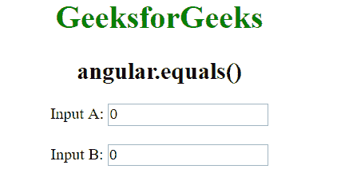
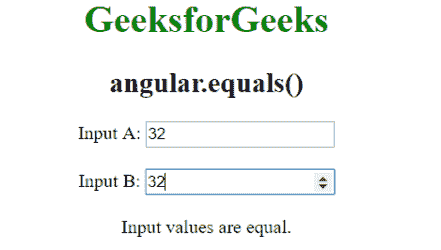
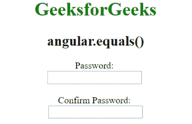
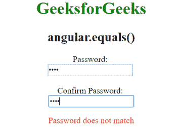
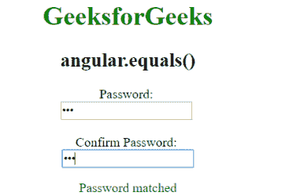

# AngularJS | angular.equals()函数

> 原文:[https://www . geeksforgeeks . org/angular js-angular-equals-function/](https://www.geeksforgeeks.org/angularjs-angular-equals-function/)

AngularJS 中的 **angular.equals()函数**用于比较两个对象或两个值是否相同。如果两个值相同，则返回**真**，否则返回**假**。

**语法:**

```ts
angular.equals(val1, val2)
```

其中 **val1 和 val2** 是要比较的对象的值。
**返回值:**返回真或假

**例 1:**

```ts
<html>
<head>
 <script src=
 "//ajax.googleapis.com/ajax/libs/angularjs/1.3.2/angular.min.js">
 </script>
 <title>angular.equals()</title>
 </head>

<body ng-app="app" style="text-align:Center">
  <h1 style="color:green">GeeksforGeeks</h1>
  <h2>angular.equals()</h2>

<div ng-controller="geek">
  Input A: <input type="number" ng-model="val1" ng-change="check()" />
  <br /><br>
  Input B: <input type="number" ng-model="val2" ng-change="check()" />
  <br /><br>
  {{msg}}
</div>

  <script>
  var app = angular.module("app", []);
  app.controller('geek', ['$scope', function ($scope) {
    $scope.val1 = 0;
    $scope.val2 = 0;
    $scope.check = function () {
      if (angular.equals($scope.val1, $scope.val2))
        $scope.msg = "Input values are equal.";
      else
        $scope.msg = "Input values are not equal.";
      }
    }]);

</script>
</body>
</html>
```

**输出:**
**输入:**

**输入:**


**例 2:**

```ts
<html>
<head>
 <script src=
 "//ajax.googleapis.com/ajax/libs/angularjs/1.3.2/angular.min.js">
 </script>
 <title>angular.equals()</title>
 </head>

 <body ng-app="app" style="text-align:Center">
   <h1 style="color:green">GeeksforGeeks</h1>
   <h2>angular.equals()</h2>

<body ng-app="app">
 <div ng-controller="geek">
    Password: <br>
    <input type="password" ng-model="pass" />
    <br><br>
    Confirm  Password: <br>
    <input type="password" ng-model="PASS" ng-change="match()" /><br />
    <p ng-show="isMatch" style="color:green">Password matched</p>
    <p ng-hide="isMatch || PASS==null" style="color:red">
     Password does not match</p>
  </div>

<script>
  var app = angular.module("app", []);
  app.controller('geek', ['$scope', function ($scope) {
   $scope.match = function () {
   $scope.isMatch = angular.equals($scope.pass, $scope.PASS);
}
}]);

</script>
</body>
</html>
```

**输出:**
**初始:**

**错误输入:**

**正确输入:**
