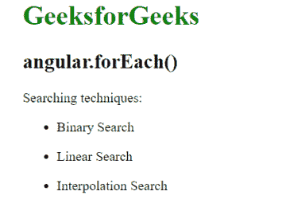

# AngularJS | angular.forEach()函数

> 原文:[https://www . geeksforgeeks . org/angular js-angular-foreach-function/](https://www.geeksforgeeks.org/angularjs-angular-foreach-function/)

AngularJS 中的 **angular.forEach()函数**用于迭代数组或对象中的每一项。它的工作方式类似于 for 循环，该循环包含对象键值对中对象的所有属性。

**语法:**

```ts
angular.forEach(object, iterator, [context])
```

**参数值:**

*   **对象:**指要迭代的对象。
*   **迭代器:**指迭代器函数(值、键、obj)。
*   **上下文:**这是可选的。它指的是成为迭代器函数上下文的对象。

**示例:**

```ts
<html>
    <head>
        <script src=
        "//ajax.googleapis.com/ajax/libs/angularjs/1.3.2/angular.min.js">
        </script>
        <title>angular.forEach()</title>
    </head>

    <body ng-app="app" ng-cloak style="padding:30px">
    <h1 style="color:green">GeeksforGeeks</h1>
    <h2>angular.forEach()</h2>
    <p>Searching techniques:</p>
    <div ng-controller="geek">
        <div ng-repeat="name in names">
            <ul><li>{{name}}</li></ul>
        </div>
    </div>
    <script>
        var app = angular.module("app", []);
        app.controller('geek', ['$scope', function ($scope) {
            $scope.names = [];
            var values = [
            {name: 'Binary Search'},
            {name: 'Linear Search'},
            {name: 'Interpolation Search'}
            ];  
            angular.forEach(values, function (value, key) {
                $scope.names.push(value.name);
            });  
        }]);

    </script>
</body>
</html>
```

**输出:**
