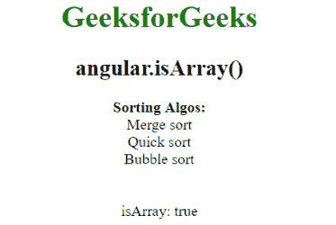
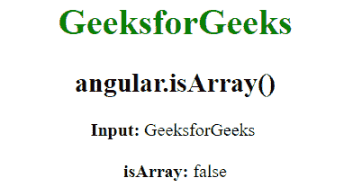

# AngularJS | angular.isArray()函数

> 原文:[https://www . geeksforgeeks . org/angular js-angular-isarray-function/](https://www.geeksforgeeks.org/angularjs-angular-isarray-function/)

AngularJS 中的 **angular.isArray()函数**用于返回 **TRUE** 如果引用是数组，则返回 **FALSE** 如果不是数组。
**语法:**

```ts
angular.isArray(value)
```

**返回值:**如果该值是数组，则返回真，否则返回假。

**例 1:**

```ts
<html>
    <head>
        <title>angular.isArray()</title>
    <script src=
    "https://ajax.googleapis.com/ajax/libs/angularjs/1.5.6/angular.min.js"> 
    </script>
    </head>
    <body ng-app="app" style="text-align:Center">
        <h1 style="color:green">GeeksforGeeks</h1>

        <h2>angular.isArray()</h2>

        <div ng-controller="geek">
            <b>Sorting Algos:</b>
            <div ng-repeat="i in sort">{{i.name}}</div>
            <br><br>
            isArray: {{isArray}}
        </div>

        <script>
        var app = angular.module("app", []);
        app.controller('geek', ['$scope', function ($scope) {
            $scope.sort = [];
            var values = [
            { name: 'Merge sort' }, 
            { name: 'Quick sort' }, 
            { name: 'Bubble sort' }
            ];
            if (angular.isArray(values)) {
                $scope.isArray = true;
                angular.forEach(values, function (value, key) {
                    $scope.sort.push(value)
                })
            }
        }]);
        </script>
    </body>
</html>
```

**输出:**


**例 2:**

```ts
<!DOCTYPE html>
<html>
    <head>
        <title>angular.isArray()</title>
    <script src=
    "https://ajax.googleapis.com/ajax/libs/angularjs/1.5.6/angular.min.js"> 
    </script>
    </head>
    <body ng-app="app" style="text-align:Center">
        <h1 style="color:green">GeeksforGeeks</h1>
        <h2>angular.isArray()</h2>
        <div ng-controller="geek">
        <b>Input: </b>{{name}}
        <br><br>
            <b>isArray:</b> {{isArray}}
        </div>
        <script>
            var app = angular.module("app", []);
            app.controller('geek', ['$scope', function ($scope) {
                var values = 'GeeksforGeeks';
                $scope.name = values;
                $scope.isArray = angular.isArray(values)
            }]);
        </script>
    </body>
</html>
```

**输出:**
