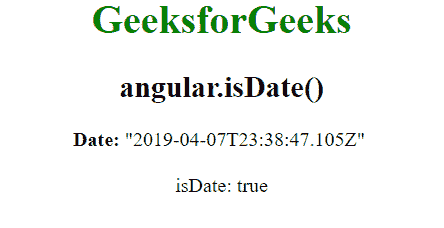

# AngularJS | angular.isDate()函数

> 原文:[https://www . geeksforgeeks . org/angular js-angular-is date-function/](https://www.geeksforgeeks.org/angularjs-angular-isdate-function/)

AngularJS 中的 **angular.isDate()函数**用于确定日期值是否有效。如果引用是日期，则返回 true，否则返回 false。

**语法:**

```
angular.isDate( value )
```

**参数:**该功能接受存储日期对象的单参数**值**。

**返回值:**如果传递的值是 date，则返回 true，否则返回 false。

**示例:**本示例使用 angular.isDate()函数确定日期值是否有效。

```
<!DOCTYPE html>
<html>

<head>
    <title>angular.isDate() function</title>

    <script src=
"//ajax.googleapis.com/ajax/libs/angularjs/1.3.2/angular.min.js">
    </script>
</head>

<body ng-app="app" style="text-align:center">
    <h1 style="color:green">GeeksforGeeks</h1>
    <h2>angular.isDate()</h2>

    <div ng-controller="geek">
        <b>Date:</b> {{ date }} <br><br>
            isDate: {{isDate}} 
    </div>

    <!-- Script to uses angular.isDate() function -->
    <script>
        var app = angular.module("app", []);
        app.controller('geek', ['$scope', function ($scope) {
            $scope.date = new Date;
            $scope.isDate = angular.isDate($scope.date)
        }]);
    </script>
</body>

</html>                    
```

**输出:**
