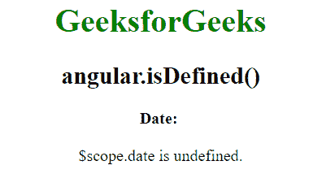
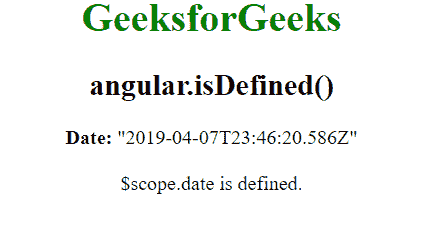

# AngularJS | angular.isDefined()函数

> 原文:[https://www . geeksforgeeks . org/angular js-angular-is defined-function/](https://www.geeksforgeeks.org/angularjs-angular-isdefined-function/)

AngularJS 中的 **angular.isDefined()函数**用于确定 isDefined 函数内部的值是否定义。如果引用是已定义的，则返回 true，否则返回 false。

**语法:**

```ts
angular.isDefined( value )
```

**返回值:**如果定义了传递的值，则返回真，否则返回假。

**示例:**本示例使用 angular.isDefined()函数来确定是否定义了 isDefined 函数内部的值。

```ts
<!DOCTYPE html>
<html>
    <head>
        <title>angular.isDefined()</title>

        <script src=
"//ajax.googleapis.com/ajax/libs/angularjs/1.3.2/angular.min.js">
        </script>
    </head>

    <body ng-app="app" style="text-align:center">
        <h1 style="color:green">GeeksforGeeks</h1>
        <h2>angular.isDefined()</h2>

        <div ng-controller="geek">
            <b>Date:</b> {{date}}<br><br>
            {{isDefined}}
        </div>

        <!-- Script to uses angular.isDefined() function -->
        <script>
            var app = angular.module("app", []);
            app.controller('geek', ['$scope', function ($scope) {
            $scope.date;

            $scope.isDefined = angular.isDefined($scope.date)
                    == true ? "$scope.date is defined."
                    : "$scope.date is undefined.";
            }]);
        </script>
    </body>
</html>                    
```

**输出:**

*   **未定义的日期:**
    
*   **如果定义了日期，其值为“2019-04-07t 23:46:20.586”:**
    