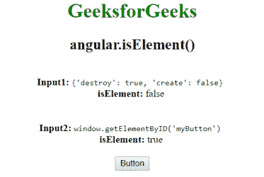

# AngularJS | angular . iseelement()函数

> 原文:[https://www . geeksforgeeks . org/angular js-angular-iseelement-function/](https://www.geeksforgeeks.org/angularjs-angular-iselement-function/)

AngularJS 中的**angular . isElement()函数**用于判断 iseelement 函数中的*参数是否为 HTML DOM 元素*。如果引用是 DOM 元素，则返回 true，否则返回 false。

**语法:**

```ts
angular.isElement(value)
```

**返回值:**如果传递的值是 HTML DOM 元素，则返回 true，否则返回 false。

**示例:**

```ts
<!DOCTYPE html>
<html>

<head>
    <script src=
"//ajax.googleapis.com/ajax/libs/angularjs/1.3.2/angular.min.js">
    </script>
    <title>
      angular.isElement()
  </title>
</head>

<body ng-app="testApp" 
      style="text-align:center">

    <h1 style="color:green">
      GeeksforGeeks
  </h1>
    <h2>
      angular.isElement()
  </h2>

    <div ng-controller="geek">
        <br>
        <b>Input1:</b>
        <code>
            {'destroy': true, 'create': false}
        </code>
        <br>
        <b>isElement:</b> {{ isElement1 }}
        <br>
        <br>
        <br>
        <b>Input2:</b>
        <code> 
            window.getElementByID('myButton')
        </code>
        <br>
        <b>isElement:</b> {{ isElement2 }}
        <br>
        <br>
        <button id="myButton"> Button</button>
    </div>
    <script>
        var app = angular.module('testApp', []);

        app.controller('geek', function($scope) {

            $scope.obj1 = {
                'destroy': true,
                'create': false
            };
            $scope.obj2 = document.getElementById('myButton');
            $scope.isElement1 = 
              angular.isElement($scope.obj1);

            $scope.isElement2 = 
              angular.isElement($scope.obj2);
        });
    </script>
</body>

</html>
```

**输出:**
