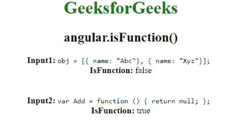

# AngularJS | angular . is Function()函数

> 原文:[https://www . geeksforgeeks . org/angular js-angular-is function-function/](https://www.geeksforgeeks.org/angularjs-angular-isfunction-function/)

AngularJS 中的 **angular.isFunction()函数**用于*判断 isFunction 函数中的参数是否为函数*。
如果引用是函数，则返回**true**false。

**语法:**

```ts
angular.isFunction(value)
```

**返回值:**如果传递的值是函数，则返回真，否则返回假。

**示例:**

```ts
<!DOCTYPE html>
<html>

<head>
    <script src=
"//ajax.googleapis.com/ajax/libs/angularjs/1.3.2/angular.min.js">
    </script>
    <title>
      angular.isFunction()
  </title>
</head>

<body ng-app="app"
      style="text-align:center">
    <h1 style="color:green">
      GeeksforGeeks
  </h1>
    <h2>
      angular.isFunction()
  </h2>

    <body ng-app="app">
        <div ng-controller="geek">
            <b>Input1: </b>
            <span>
                 <code>
                  obj = [
                   { name: "Abc"},
                   { name: "Xyz"}
                   ];
                </code>
                </span>
            <br>
            <b>IsFunction: </b>
          {{isFunction1}}
            <br />
            <br>
            <br>
            <b>Input2: </b>
            <code>
        var Add = function () {
            return null;
        };
        </code>
            <br>
            <b>IsFunction:</b>
          {{isFunction2}}
        </div>
        <script>
            var app = 
                angular.module("app", []);
            app.controller('geek', 
                     ['$scope', function($scope) {
                var obj = [{
                    name: "Abc"
                }, {
                    name: "Xyz"
                }];
                var Add = function() {
                    return null;
                };
                $scope.isFunction1 = 
                  angular.isFunction(obj);

                $scope.isFunction2 = 
                  angular.isFunction(Add);
            }]);
        </script>
    </body>

</html>
```

**输出:**
