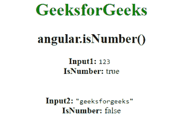

# AngularJS | angular.isNumber()函数

> 原文:[https://www . geeksforgeeks . org/angular js-angular-is number-function/](https://www.geeksforgeeks.org/angularjs-angular-isnumber-function/)

AngularJS 中的 **angular.isNumber()函数**用于确定 isNumber 函数中的参数是否为数字。如果引用是数字，则返回 true，否则返回 false。

**语法:**

```
angular.isNumber( value )
```

**返回值:**如果传递的值是数字，则返回真，否则返回假。

**示例:**本示例使用 angular.isNumber()函数确定给定输入是否为数字。

```
<!DOCTYPE html>
<html>
    <head>
        <title>angular.isNumber()</title>

        <script src=
        "//ajax.googleapis.com/ajax/libs/angularjs/1.3.2/angular.min.js">
        </script>
    </head>

    <body ng-app="app" style="text-align:center">
        <h1 style="color:green">GeeksforGeeks</h1>
        <h2>angular.isNumber()</h2>

        <div ng-controller="geek">
            <b>Input1: </b> 
            <span><code>
                    123 
            </code></span>

            <br>

            <b>IsNumber: </b>{{isNumber1}}<br /><br><br>
            <b>Input2: </b> 
            <code>
                "geeksforgeeks"
            </code>
            <br>
            <b>IsNumber:</b> {{isNumber2}}
        </div>

        <!-- Script to uses angular.isNumber() Function -->
        <script>
            var app = angular.module("app", []);
            app.controller('geek', ['$scope', function ($scope) {
                var obj1 = 123;
                var obj2 = "geeksforgeeks";
                $scope.isNumber1 = angular.isNumber(obj1);
                $scope.isNumber2 = angular.isNumber(obj2);
            }]);
        </script>
    </body>
</html>                    
```

**输出:**
