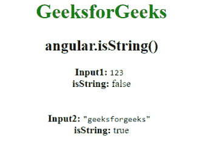

# AngularJS | angular.isString()函数

> 原文:[https://www . geeksforgeeks . org/angular js-angular-isstring-function/](https://www.geeksforgeeks.org/angularjs-angular-isstring-function/)

AngularJS 中的 **angular.isString()函数**用于确定 isString 函数内部的参数是否为字符串。如果引用是字符串，则返回 true，否则返回 false。

**语法:**

```
angular.isString( value )
```

**返回值:**如果传递的值是字符串，则返回真，否则返回假。

**示例:**本示例使用 angular.isString()函数来确定 isString 函数内部的参数是否为字符串。

```
<!DOCTYPE html>
<html>
    <head>
        <title>angular.isString() function</title>

        <script src=
"//ajax.googleapis.com/ajax/libs/angularjs/1.3.2/angular.min.js">
        </script>
    </head>

    <body ng-app="app" style="text-align:center">
        <h1 style="color:green">GeeksforGeeks</h1>
        <h2>angular.isString()</h2>

        <div ng-controller="geek">
            <b>Input1: </b> 
                <span>
                    <code>123</code>
                </span>
            <br>

            <b>isString: </b>{{isString1}}<br /><br><br>
            <b>Input2: </b> 

            <code>
                "geeksforgeeks"
            </code>
            <br>

            <b>isString:</b> {{isString2}}
        </div>

        <!-- Script to use angular.isString() function -->
        <script>
            var app = angular.module("app", []);
            app.controller('geek', ['$scope', function ($scope) {
                var obj1 = 123;
                var obj2 = "geeksforgeeks";
                $scope.isString1 = angular.isString(obj1);
                $scope.isString2 = angular.isString(obj2);
            }]);
        </script>
    </body>
</html>                    
```

**输出:**
