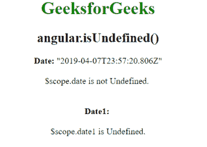

# angular js | angular . isundefined()函数

> 原文:[https://www . geeksforgeeks . org/angular js-angular-is undefined-function/](https://www.geeksforgeeks.org/angularjs-angular-isundefined-function/)

AngularJS 中的 **angular.isUndefined()函数**用于确定 isUndefined 函数内部的值是否未定义。如果引用未定义，则返回 true，否则返回 false。

**语法:**

```
angular.isUndefined( value )
```

**返回值:**如果传递的值未定义则返回真，否则返回假。

**示例:**本示例使用 angular.isUndefined()函数来确定 isUndefined 函数内部的值是否未定义。

```
<!DOCTYPE html>
<html>
    <head>
        <title>angular.isUndefined() function</title>

        <script src=
"//ajax.googleapis.com/ajax/libs/angularjs/1.3.2/angular.min.js">
        </script>
    </head>

    <body ng-app="app" style="text-align:center">
        <h1 style="color:green">GeeksforGeeks</h1>
        <h2>angular.isUndefined()</h2>

        <div ng-controller="isDefinedController">
            <b>Date:</b> {{date}}<br><br>
                    {{isUndefined}}
            <br><br><br>
            <b>Date1:</b> {{date1}}<br><br>
                            {{isUndefined1}}

        </div>

        <!-- Script to uses angular.isUndefined() function -->
        <script>
            var app = angular.module("app", []);
            app.controller('isDefinedController',
                        ['$scope', function ($scope) {
                $scope.date = new Date;
                $scope.date1;

                $scope.isUndefined = angular.isUndefined($scope.date)
                        == true ? "$scope.date is Undefined." 
                        : "$scope.date is not Undefined.";

                $scope.isUndefined1 = angular.isUndefined($scope.date1)
                        == true ? "$scope.date1 is Undefined." 
                        : "$scope.date1 is not Undefined.";
            }]);
        </script>
    </body>
</html>
```

**输出:**
