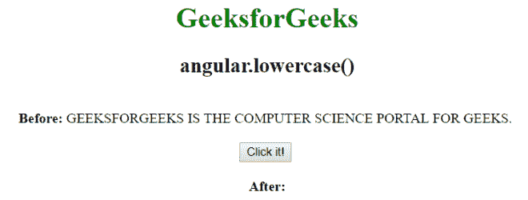
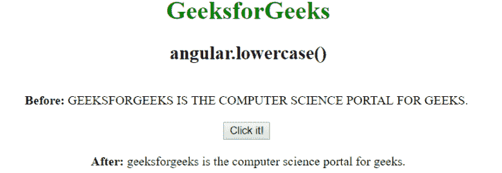

# AngularJS | angular .小写()函数

> 原文:[https://www . geeksforgeeks . org/angular js-angular-小写-function/](https://www.geeksforgeeks.org/angularjs-angular-lowercase-function/)

AngularJS 中的 **angular .小写()函数**用于将字符串转换为**小写**。当用户想要以小写而不是大写显示文本或者想要比较两个字符串时，可以使用它。
**语法:**

```
angular.lowercase(string)
```

**示例:**在本例中，字符串被转换为小写。

```
<html ng-app="app">
    <head>
    <script src=
    "https://ajax.googleapis.com/ajax/libs/angularjs/1.4.2/angular.min.js">
    </script>
    <title>angular.lowercase()</title>
    </head>
    <body style="text-align:center">
        <h1 style="color:green">GeeksforGeeks</h1>
        <h2>angular.lowercase()</h2>
        <div ng-controller="geek">
        <br>
        <b>Before: </b>{{ string1 }}
        <br><br>
        <button id="myButton" ng-mousedown="lower()">Click it!</button>
        <br><br>

        <b>After: </b>{{ string2 }}
        </div>
        <script>
            var app = angular.module('app', []);
            app.controller('geek', function($scope) {
            $scope.obj1 = 
            "GEEKSFORGEEKS IS THE COMPUTER SCIENCE PORTAL FOR GEEKS."
            $scope.obj2;
            $scope.string1 = $scope.obj1;
            $scope.lower = function() {
            $scope.string2 = angular.lowercase($scope.obj1);
            }
            });
        </script>
    </body>
</html>
```

**输出:**
**点击前:**

**点击后:**
