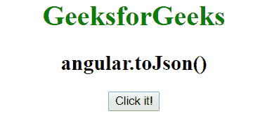
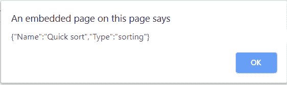

# AngularJS | angular.toJson()函数

> 原文:[https://www . geeksforgeeks . org/angular js-angular-to JSON-function/](https://www.geeksforgeeks.org/angularjs-angular-tojson-function/)

AngularJS 中的 **angular.toJson()函数**用于*将 javascript 对象序列化为 Json 格式的字符串*。它接受 javascript 对象并返回 JSON 字符串。

**语法:**

```
angular.toJson(object)
```

**示例:**

```
<!DOCTYPE html>
<html>

<head>
    <script src=
"//ajax.googleapis.com/ajax/libs/angularjs/1.3.2/angular.min.js">
    </script>
    <title>
      angular.toJson()
  </title>
</head>

<body ng-app="app" 
      style="text-align:center">
    <h1 style="color:green">
      GeeksforGeeks
  </h1>
    <h2>
      angular.toJson()
  </h2>
    <div ng-controller="geek">
        <button ng-click="showAlert()">
          Click it!</button>
    </div>
    <script>
        var app = angular.module("app", []);
        app.controller('geek', ['$scope',
                         function($scope) {

            $scope.showAlert = function() {
                var string = {
                    'Name': 'Quick sort',
                    'Type': 'sorting'
                };
                alert(angular.toJson(string));
            }
        }]);
    </script>
</body>

</html>
```

**输出:**
**点击前:**

**点击后:**
