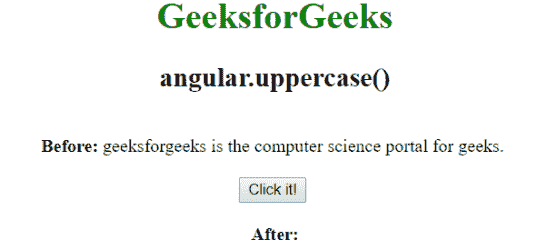
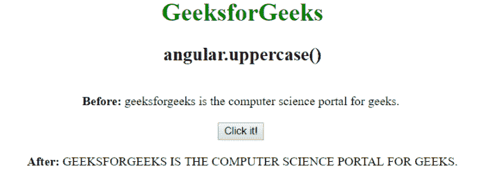

# AngularJS | angular .大写()函数

> 原文:[https://www . geesforgeks . org/anglarjs-angular-大写-function/](https://www.geeksforgeeks.org/angularjs-angular-uppercase-function/)

AngularJS 中的 **angular .大写()函数**用于将字符串转换为**大写**。当用户想用大写字母而不是小写字母显示文本时，可以使用它。
**语法:**

```
angular.uppercase(string)
```

**示例:**在本例中，字符串被转换为大写。

```
<html ng-app="app">
<head>
<script src=
"https://ajax.googleapis.com/ajax/libs/angularjs/1.4.2/angular.min.js">
</script>
    <title>angular.uppercase()</title>
    </head>
    <body style="text-align:center">
     <h1 style="color:green">GeeksforGeeks</h1>
     <h2>angular.uppercase()</h2>
     <div ng-controller="geek">
     <br>
     <b>Before: </b>{{ string1 }}
     <br><br>
     <button id="myButton" ng-mousedown="upper()">Click it!
     </button>
     <br><br>

     <b>After: </b>{{ string2 }}
     </div>

     <script>
       var app = angular.module('app', []);
       app.controller('geek', function($scope) {
       $scope.obj1 = 
       "geeksforgeeks is the computer science portal for geeks."
       $scope.obj2;
       $scope.string1 = $scope.obj1;
       $scope.upper = function() {
       $scope.string2 = angular.uppercase($scope.obj1);
       }
    });
    </script>
    </body>
</html>
```

**输出:**
**点击前:**

**点击后:**
