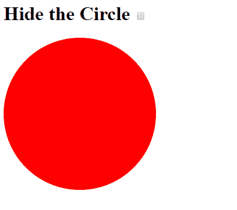
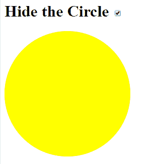
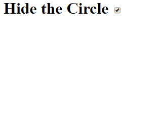

# 角度 JS |动画

> 哎哎哎:# t0]https://www . geeksforgeeks . org/angolajs 动画/

在“角度”中创建动画效果。Js 使用了 ngAnimate 模块，为基于 CSS 的动画提供支持。
动画是用来给出动态运动效果的东西。在这里，HTML 被转换为使用 ngAnimate 模块给我们一种运动的错觉，该模块给我们一种 Javascript 和 CSS 的组合效果。

使用这个示例代码，通过选中复选框来显示隐藏分区/部分的演示。

**使用 AngularJs 将动画带入图片的步骤:**

*   包括 Angular。Js 将脚本标签中的 lib 动画化为:

    > src = " https://Ajax。谷歌 API。com/Ajax/libs/angolajs/1。6 .9/角度-动画。js”
    > 
    > T4】

*   参考车身内侧的发动机舱标签:

    > ng-app=【发动机舱模块】

*   ngAnimate 模块添加和删除类。在 AngularJS 中用于添加/删除类的指令是:

    > 展示,隐藏

**示例:**下面是 Angular 的实现。Js 动画。

```ts
<html>
<style>
    div {
        transition: 0.6s;
        border-radius: 500%;
        height: 250px;
        width: 250px;
        background-color: red;
        display: inline-block;
    }

    .ng-hide {
        background-color: yellow;
        top: 5px;
        left: 100px;
    }
</style>

<script src=
"https://ajax.googleapis.com/ajax/libs/angularjs/1.6.9/angular.min.js">
  </script>

<script src=
"https://ajax.googleapis.com/ajax/libs/angularjs/1.6.9/angular-animate.js">
  </script>

<body ng-app="ngAnimate">

    <h1>Hide the Circle 
      <input type="checkbox" 
             ng-model="myCheck">
  </h1>

    <div ng-hide="myCheck"></div>

</body>

</html>
```

**输出:**
**前:**


**之后:**


