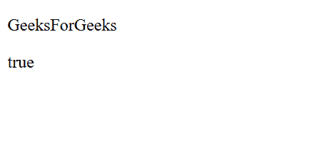
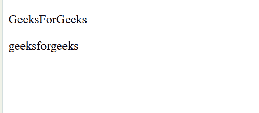
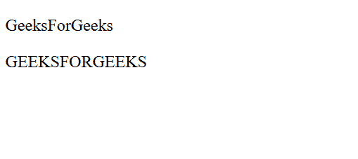
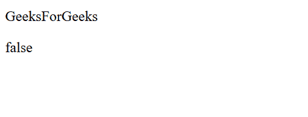

# 角度\ API

> 原文:[https://www.geeksforgeeks.org/angularjs-api/](https://www.geeksforgeeks.org/angularjs-api/)

AngularJS API 用于比较、迭代和转换对象。基本的 AngularJS 应用编程接口包括

*   angular.isString()
*   angular .小写()
*   angular .大写()
*   angular.isNumber()

**1。angular.isString()**
用于检查对象是否为字符串。如果对象是字符串，则返回 true，否则返回 false。
**例:**

```ts
<!-- Write HTML code here -->
<!DOCTYPE html>
<html>
  <head>
<script src=
"https://ajax.googleapis.com/ajax/libs/angularjs/1.6.9/angular.min.js">
</script>
  </head>
  <body>

    <div ng-app="gfg" ng-controller="gfgCntrl">
    <p>{{ object }}</p>
    <p>{{ apiRes }}</p>
    </div>

    <script>
      var app = angular.module('gfg', []);
      app.controller('gfgCntrl', function($scope) {
          $scope.object = "GeeksForGeeks";
          $scope.apiRes = angular.isString($scope.object);
      });
    </script>

  </body>
</html>
```

**输出:**


**2。angular .小写()**
用于将字符串中的所有字符转换为小写字符。
**例:**

```ts
<!-- Write HTML code here -->
<!DOCTYPE html>
<html>
  <head>
<script src=
"https://ajax.googleapis.com/ajax/libs/angularjs/1.6.9/angular.min.js">
</script>
  </head>
  <body>

    <div ng-app="gfg" ng-controller="gfgCntrl">
    <p>{{ object }}</p>
    <p>{{ apiRes }}</p>
    </div>

    <script>
      var app = angular.module('gfg', []);
      app.controller('gfgCntrl', function($scope) {
          $scope.object = "GeeksForGeeks";
          $scope.apiRes = angular.lowercase($scope.object);
      });
    </script>

  </body>
</html>
```

**输出:**


**3。angular .大写()**
用于将字符串中的所有字符转换为大写字符。
**例:**

```ts
<!-- Write HTML code here -->
<!DOCTYPE html>
<html>
  <head>
<script src=
"https://ajax.googleapis.com/ajax/libs/angularjs/1.6.9/angular.min.js">
</script>
  </head>
  <body>

    <div ng-app="gfg" ng-controller="gfgCntrl">
    <p>{{ object }}</p>
    <p>{{ apiRes }}</p>
    </div>

    <script>
      var app = angular.module('gfg', []);
      app.controller('gfgCntrl', function($scope) {
          $scope.object = "GeeksForGeeks";
          $scope.apiRes = angular.uppercase($scope.object);
      });
    </script>

  </body>
</html>
```

**输出:**


**4。angular.isNumber()**
用来检查一个物体是否是数字。如果对象是数字，则返回 true，否则返回 false。
**例:**

```ts
<!-- Write HTML code here -->
<!DOCTYPE html>
<html>
  <head>
<script src=
"https://ajax.googleapis.com/ajax/libs/angularjs/1.6.9/angular.min.js">
</script>
  </head>
  <body>

    <div ng-app="gfg" ng-controller="gfgCntrl">
    <p>{{ object }}</p>
    <p>{{ apiRes }}</p>
    </div>

    <script>
      var app = angular.module('gfg', []);
      app.controller('gfgCntrl', function($scope) {
          $scope.object = "GeeksForGeeks";
          $scope.apiRes = angular.isNumber($scope.object);
      });
    </script>

  </body>
</html>
```

**输出:**
