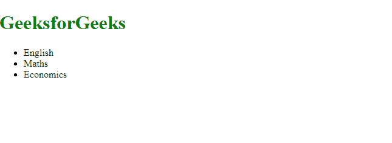
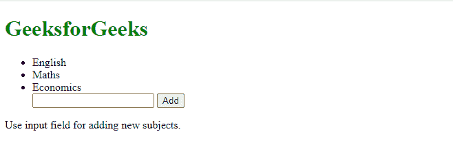
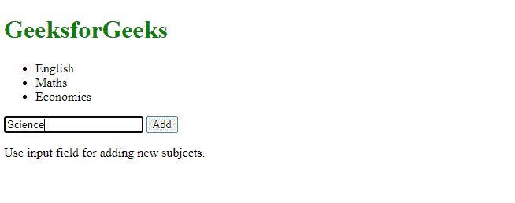
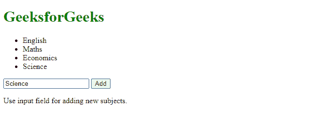
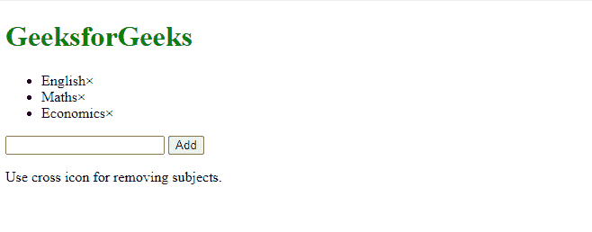
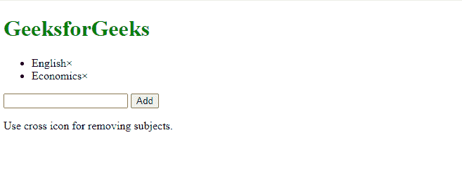
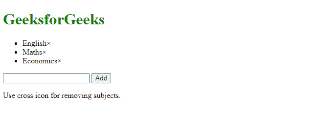
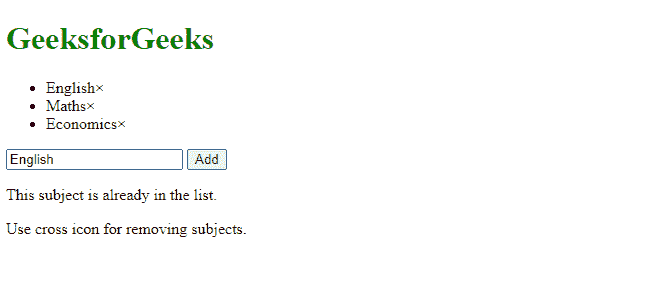

# AngularJS |应用程序

> 原文:[https://www.geeksforgeeks.org/angularjs-application/](https://www.geeksforgeeks.org/angularjs-application/)

AngularJS 中的应用程序支持实时应用程序的创建。在 AngularJS 中创建应用程序涉及四个主要步骤:

*   为应用程序创建列表。
*   在列表中添加元素。
*   从列表中删除元素。
*   错误处理

以下是创建主题列表应用程序的步骤:

**第一步:**首先，选择您想要创建的列表。然后使用，controller 和 ng-repeat 指令将数组的元素显示为列表。

```
<!DOCTYPE html>
<html>
<script src=
"https://ajax.googleapis.com/ajax/libs/angularjs/1.6.9/angular.min.js">
   </script>
<h1 style="color: green">GeeksforGeeks</h1>
<body>

<script>
var app = angular.module("Subjects", []); 
app.controller("my_Ctrl", function($scope) {
    $scope.name = [
             "English", "Maths", "Economics"];
});
</script>

<div ng-app="Subjects" ng-controller="my_Ctrl">
  <ul>
    <li ng-repeat="var in name">{{var}}</li>
  </ul>
</div>

</body>
</html>
```

**输出:**


**步骤 2:** 在您的应用程序中，借助于 *ng-model* 指令使用文本字段。在控制器中，创建一个名为 addNewSubject 的函数，并使用 addSubject 输入字段的值向“名称”数组添加一个主题。添加按钮，使用 ng-click 指令添加新主题。

```
<!DOCTYPE html>
<html>
<script src=
"https://ajax.googleapis.com/ajax/libs/angularjs/1.6.9/angular.min.js">
</script>
<h1 style="color: green">GeeksforGeeks</h1>
<body>

<script>
var app = angular.module("Subjects", []); 
app.controller("my_Ctrl", function($scope) {
    $scope.name =  ["English", "Maths", "Economics"];
    $scope.addingNewSubject = function () {
        $scope.name.push($scope.addSubject);
    }    
});
</script>

<div ng-app="Subjects" ng-controller="my_Ctrl">
  <ul>
    <li ng-repeat="x in name">{{x}}</li>
  </ul>
  <input ng-model="addSubject">
  <button ng-click="addingNewSubject()">Add</button>
</div>
<p>Use input field for adding new subjects.</p>
</body>
</html>
```

**输出:**






**第三步:**要删除一个主题，用索引作为参数，做一个删除函数。对于每个主题，制作一个 span 项，并给它们一个 ng-click 指令来调用 remove 函数。

```
<!DOCTYPE html>
<html>
<script src=
"https://ajax.googleapis.com/ajax/libs/angularjs/1.6.9/angular.min.js">
</script>
<h1 style="color: green">GeeksforGeeks</h1>
<body>

<script>
var app = angular.module("Subjects", []); 
app.controller("my_Ctrl", function($scope) {
    $scope.name =  ["English", "Maths", "Economics"];
    $scope.addingNewSubject = function () {
        $scope.name.push($scope.addSubject);
    }
     $scope.remove = function (x) {
        $scope.name.splice(x, 1);
    }
});
</script>

<div ng-app="Subjects" ng-controller="my_Ctrl">
  <ul>
    <li ng-repeat="x in name">
           {{x}}<span ng-click="remove($index)">×</span></li>
  </ul>
  <input ng-model="addSubject">
  <button ng-click="addingNewSubject()">Add</button>
</div>
<p>Use cross icon for removing subjects.</p>
</body>
</html>
```

**输出:**




**第四步:**错误需要谨慎处理。
**例如:**同一主题在列表中添加两次，会显示错误信息。

```
<!DOCTYPE html>
<html>
<script src=
"https://ajax.googleapis.com/ajax/libs/angularjs/1.6.9/angular.min.js">
</script>
<h1 style="color: green">
    GeeksforGeeks
</h1>
<body>

<script>
var app = angular.module("Subjects", []); 
app.controller("my_Ctrl", function($scope) {
    $scope.name =  ["English", "Maths", "Economics"];

     $scope.addingNewSubject = function () {
        $scope.errortext = "";
        if (!$scope.addSubject) {return;}        
        if ($scope.name.indexOf($scope.addSubject) == -1) {
            $scope.name.push($scope.addSubject);
        } else {
            $scope.errortext = 
               "This subject is already in the list.";
        }
    }

     $scope.remove = function (x) {
         $scope.errortext = ""; 
        $scope.name.splice(x, 1);
    }
});
</script>

<div ng-app="Subjects" ng-controller="my_Ctrl">
  <ul>
   <li ng-repeat="x in name">
      {{x}}<span ng-click="remove($index)">×</span>
    </li>
  </ul>
  <input ng-model="addSubject">
  <button ng-click="addingNewSubject()">Add</button>

 <p>{{errortext}}</p>
</div>
<p>Use cross icon for removing subjects.</p>
</body>
</html>
```

**输出:**


