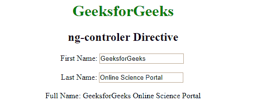

# AngularJS |控制器

> 原文:[https://www.geeksforgeeks.org/angularjs-controllers/](https://www.geeksforgeeks.org/angularjs-controllers/)

AngularJS 控制器在 AngularJS 应用中发挥着重要作用。所有的 AngularJS 应用程序主要依靠控制器来控制应用程序中的数据流。基本上，它控制 AngularJS 应用程序的数据，控制器是 **Javascript 对象**，由标准 JavaScript **对象构造器**创建。

**ng 控制器指令**定义了应用控制器。在 AngularJS 中，一个控制器由一个 Javascript 构造函数定义，该函数用于 AngularJS 作用域，并且函数**$作用域】**是在控制器定义时定义的，它返回**$作用域.名字**和**$作用域.姓氏**的连接。

**语法:**

```ts
<element ng-controller="expression">Contents...</element>
```

**示例:**本示例使用 ng-controller 指令显示用户第一次和第二次输入的连接。

## java 描述语言

```ts
<!DOCTYPE html>
<html>

<head>
    <title>ng-controller Directive</title>

    <script src=
"https://ajax.googleapis.com/ajax/libs/angularjs/1.6.9/angular.min.js">
    </script>

    <script>
        var app = angular.module('myApp', []);
        app.controller('myCtrl', function($scope) {
            $scope.firstName = "Geeks";
            $scope.lastName = "Geeks";
        });
    </script>

</head>
<center>

    <body>
        <h1 style="color:green">GeeksforGeeks</h1>
        <h2>ng-controller Directive</h2>
        <div ng-app="myApp" ng-controller="myCtrl">

            First Name:
            <input type="text" ng-model="firstName">
            <br> Last Name:
            <input type="text" ng-model="lastName">
            <br>
            <br> Full Name: {{firstName + "for" + lastName}}

        </div>

    </body>
</center>

</html>
```

**输出:**


**控制器方法**
第一个例子展示了一个具有两个属性的控制器对象:Fname 和 Lname。在 AngularJS 中，函数($scope)是在控制器定义时定义的，它返回$scope.firstname 和$scope.lastname 的连接。在这里，控制器也可以有方法(变量作为函数):

**示例:**

## java 描述语言

```ts
<!DOCTYPE html>
<html>

<head>
    <title>ng-controller Directive</title>

    <script src=
"https://ajax.googleapis.com/ajax/libs/angularjs/1.6.9/angular.min.js">
    </script>

    <script>
        var app = angular.module('geeks', []);
        app.controller('personCtrl', function($scope) {

            $scope.fullName = function() {
                return $scope.firstName + " " + $scope.lastName;
            };
        });
    </script>

</head>
<center>
<body style="padding: 30px">
    <div ng-app="geeks" ng-controller="personCtrl">
        <h1 style="color:green">GeeksforGeeks</h1>
        <h2>ng-controller Directive</h2> First Name:
        <input type="text" ng-model="firstName">
        <br><br> Last Name:
        <input type="text" ng-model="lastName">
        <br>
        <br> Full Name: {{fullName()}}
    </div>
</body>
</center>
</html>                   
```

**输出:**
**写名字前:**


**写完名字后:**T2】



**外部文件中的控制器**

在较大的应用程序中，通常将控制器存储在外部文件中，您只需复制该文件名并将其粘贴到

**示例:**

## java 描述语言

```ts
<!DOCTYPE html>
<html>
<head>
   <script src=
"https://ajax.googleapis.com/ajax/libs/angularjs/1.6.9/angular.min.js">
   </script>
   <script src="geeksforgeeks.js"></script>
</head>
<body>
   <center>
      <h1 style="color:green">GeeksforGeeks</h1>
      <h2>ng-controller Directive</h2>

      <div ng-app="myApp" ng-controller="personCtrl">
          First Name: <input type="text" ng-model="firstName">
          <br>
          Last Name: <input type="text" ng-model="lastName">
          <br><br>
          Full Name: {{fullName()}}
      </div>
   </center>
</body>
</html>
```

**输出:**

