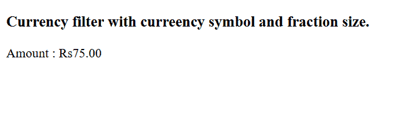
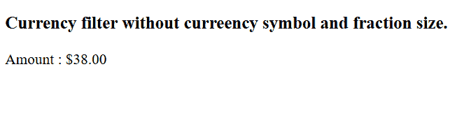

# AngularJS |货币过滤器

> 原文:[https://www.geeksforgeeks.org/angularjs-currency-filter/](https://www.geeksforgeeks.org/angularjs-currency-filter/)

AngularJS 货币过滤器用于将数字转换为货币格式。如果未指定货币格式，货币筛选器将使用本地货币格式。
**语法:**

```
{{ currency_expression | currency : symbol : fractionSize}}
```

**参数:**包含两个参数，如上所述，描述如下:

*   **符号:**为可选参数。它用于指定货币符号。货币符号可以是任何字符或文本。
*   **分数:**可选参数。它用于指定小数位数。

**示例 1:** 本示例以印度货币格式显示数字。

## 超文本标记语言

```
<!DOCTYPE html>
<html>
    <head>
        <title>Currency Filter</title>

        <script src=
"https://ajax.googleapis.com/ajax/libs/angularjs/1.6.9/angular.min.js">
        </script>
    </head>

    <body>

        <div ng-app="gfgApp" ng-controller="currencyCntrl">

            <h3>
                Currency filter with currency
                symbol and fraction size.
            </h3>

<p>Amount : {{ amount | currency : "Rs" : 2}}</p>

        </div>

        <script>
            var app = angular.module('gfgApp', []);

            app.controller('currencyCntrl', function($scope) {
                $scope.amount = 75;
            });
        </script>
    </body>

</html>
```

**输出:**



**示例 2:** 本示例以货币格式显示数字。

## 超文本标记语言

```
<!DOCTYPE html>
<html>
    <head>
        <title>Currency Filter</title>

        <script src=
"https://ajax.googleapis.com/ajax/libs/angularjs/1.6.9/angular.min.js">
        </script>
    </head>

    <body>

        <div ng-app="gfgApp" ng-controller="currencyCntrl">

            <h3>
                Currency filter without currency
                symbol and fraction size.
            </h3>

<p>Amount : {{ amount | currency}}</p>

        </div>

        <script>
            var app = angular.module('gfgApp', []);

            app.controller('currencyCntrl', function($scope) {
                $scope.amount = 38;
            });
        </script>

    </body>
</html>
```

**输出:**

